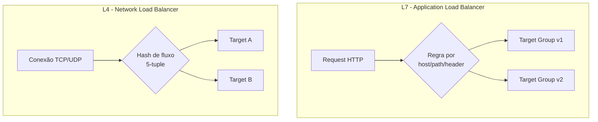
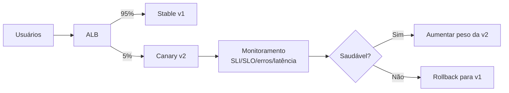

# ALB vs NLB e relação com Canary Deployment

Nesta nota você encontra:
- diferença entre **ALB** e **NLB**
- camada OSI em que cada um atua
- como cada um distribui carga
- impacto prático em estratégias de canary

---

## Visão geral rápida

- **ALB (Application Load Balancer)**: atua na camada **L7 (Aplicação)**.
- **NLB (Network Load Balancer)**: atua na camada **L4 (Transporte)**.

---

## ALB (L7)

O ALB entende protocolos HTTP/HTTPS e consegue tomar decisão de roteamento com base em:
- host
- path
- método
- headers
- query string

### Distribuição de carga no ALB

No ALB, o balanceamento ocorre entre targets saudáveis no target group.
Na prática de arquitetura, costuma ser tratado como distribuição do tipo **round-robin** por requisição dentro das regras e grupos definidos.

Recursos úteis:
- sticky sessions (afinidade por cookie)
- weighted target groups
- roteamento avançado por regras

---

## NLB (L4)

O NLB trabalha com TCP/UDP/TLS em alto desempenho e baixa latência, sem interpretar semântica HTTP (path/header).

### Distribuição de carga no NLB

No NLB, a distribuição é orientada a **fluxo de conexão** (hash/5-tuple), enviando conexões para targets saudáveis.

Características:
- muito bom para tráfego de rede intenso
- estável por fluxo
- sem roteamento HTTP avançado nativo

---

## Desenho comparativo

---

## Canary Deployment: como se relaciona

Canary deployment é liberar uma nova versão para uma pequena fração do tráfego e aumentar gradualmente.

### Canary com ALB

ALB facilita muito canary em aplicações HTTP:
- usa pesos entre target groups (ex.: 95% estável / 5% canário)
- permite segmentação por regras HTTP (header, path etc.)

### Canary com NLB

Com NLB, o balanceador não tem semântica HTTP para roteamento avançado.
Por isso, canary normalmente é implementado com:
- service mesh (Istio/Linkerd)
- controladores de rollout (Argo Rollouts, Flagger)
- estratégia de DNS/infra complementar

---

## Desenho de canary com ALB

---

## Resumo final

- **ALB**: L7, melhor para web/microserviços e canary baseado em HTTP.
- **NLB**: L4, melhor para throughput/latência e protocolos de transporte.
- **KEDA + Canary**: canary distribui tráfego entre versões; KEDA escala cada versão conforme demanda/eventos.
