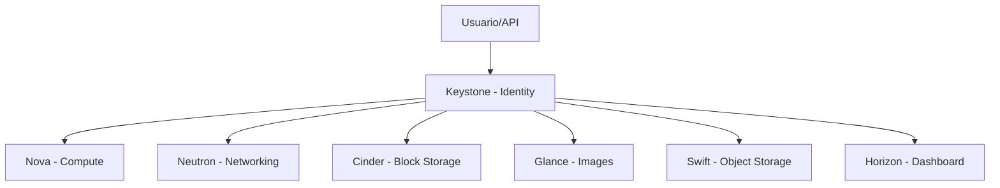

# OpenStack

## O que é OpenStack

O **OpenStack** é uma plataforma open source para construção de nuvem privada (IaaS), composta por vários serviços modulares. Ele permite oferecer recursos de **compute, rede, storage e identidade** de forma parecida com cloud pública.

No estudo, OpenStack é excelente para entender como “a nuvem funciona por dentro”.

---

## Serviços principais (visão de alto nível)

## Keystone (Identity)
Autenticação, autorização e catálogo de serviços.

## Nova (Compute)
Gerencia ciclo de vida de instâncias (VMs).

## Neutron (Networking)
Redes, sub-redes, roteadores, security groups, floating IPs.

## Glance (Image)
Registro e distribuição de imagens de VM.

## Cinder (Block Storage)
Volumes persistentes para instâncias.

## Swift (Object Storage)
Armazenamento de objetos (estilo S3-like).

## Horizon (Dashboard)
Painel web para operações administrativas e de projeto.

## Heat (Orchestration)
Orquestra infraestrutura com templates.

## Octavia (Load Balancer)
Balanceamento de carga como serviço.

---

## Conceitos que você precisa dominar

- **Projeto (tenant):** isolamento lógico de recursos.
- **Flavor:** perfil de CPU/RAM/disco da instância.
- **Imagem:** base de sistema para criar VMs.
- **Volume:** disco persistente desacoplado da VM.
- **Rede privada:** rede interna do projeto.
- **Security Group:** firewall em nível de instância.
- **Floating IP:** IP público associado dinamicamente.

---

## Fluxo mínimo de criação de ambiente

1. Criar projeto e usuário.
2. Definir rede, sub-rede e roteador.
3. Registrar imagem (Ubuntu, por exemplo).
4. Criar keypair.
5. Criar security group (SSH/HTTP quando necessário).
6. Subir instância com flavor adequado.
7. Associar floating IP para acesso externo.

Esse fluxo é a base operacional de praticamente todo laboratório OpenStack.

---

## OpenStack para estudo em homelab

Você pode estudar em homelab de três formas:

## 1) Laboratório all-in-one (mais simples)
- Tudo em um host robusto;
- Bom para aprender serviços e APIs;
- Menor fidelidade de alta disponibilidade.

## 2) Multi-node compacto
- 1 controller + 1 ou 2 computes;
- Melhor para aprender arquitetura real;
- Exige rede e hardware mais organizados.

## 3) Nested virtualization
- OpenStack rodando dentro de VMs em Proxmox;
- Excelente para estudo sem muito hardware físico;
- Atenção a desempenho e requisitos de virtualização aninhada.

---

## OpenStack para estudo de cloud (mentalidade profissional)

OpenStack ajuda a desenvolver competências de cloud que servem para AWS/Azure/GCP:

- arquitetura multi-tenant;
- redes virtuais e políticas de segurança;
- elasticidade de compute;
- storage por tipo de workload;
- automação por API e IaC;
- governança de acesso e segregação por projeto.

---

## Roteiro prático de aprendizado (8 semanas)

### Semanas 1–2: Fundamentos
- instalar ambiente de laboratório (DevStack, MicroStack, Kolla-Ansible ou distribuição equivalente);
- entender Keystone, Nova e Glance;
- criar/gerenciar instâncias por CLI e dashboard.

### Semanas 3–4: Rede
- praticar Neutron (rede privada, roteador, floating IP);
- testar security groups e regras leste-oeste/norte-sul;
- simular cenários de conectividade e troubleshooting.

### Semanas 5–6: Storage
- anexar/desanexar volumes Cinder;
- snapshots de volume/instância;
- introdução a object storage com Swift.

### Semanas 7–8: Automação e operação
- provisionar recursos com Terraform/OpenTofu;
- usar Ansible para configuração das instâncias;
- criar runbooks de falha comum (instância inacessível, erro de rede, volume não anexa).

---

## Integração Proxmox + OpenStack no homelab

Estratégia eficiente para estudo:

1. **Proxmox como camada base** (host de VMs).
2. **OpenStack em VMs** para simular cloud privada completa.
3. **Automação** com Terraform + Ansible.
4. **Observabilidade** com Prometheus/Grafana/Loki.

Assim você estuda tanto a camada de virtualização quanto a camada de cloud.

---

## Boas práticas de laboratório

- documentar topologia e endereçamento IP;
- separar redes de management, storage e tráfego de tenant quando possível;
- versionar scripts e arquivos de configuração em Git;
- padronizar imagens base;
- medir consumo de recursos para evitar oversubscription excessivo.

---

## Armadilhas comuns

- começar pelo “modo complexo” sem dominar o fluxo mínimo;
- ignorar DNS/NTP (causa muitos erros difíceis);
- não validar restore e recuperação de desastres;
- configurar tudo manualmente sem registrar passos.

---

## Checklist rápido de estudo

- [ ] Subir 1 instância e acessar por SSH.
- [ ] Criar rede privada + roteador + floating IP.
- [ ] Aplicar e testar security group.
- [ ] Criar volume e anexar à instância.
- [ ] Provisionar 1 ambiente com Terraform.
- [ ] Documentar incidente e solução (runbook).

---

## Próximos passos sugeridos

1. Escolher uma stack de instalação (ex.: Kolla-Ansible para caminho mais próximo de produção).
2. Criar um projeto “lab-dev” e outro “lab-prod” para praticar segregação.
3. Definir metas semanais com evidências (prints, logs, scripts).
4. Comparar os mesmos conceitos em OpenStack e em uma cloud pública.


## Mapa visual dos principais serviços OpenStack



## Fluxo de criação de VM

```text
[Autenticar no Keystone]
          |
          v
[Selecionar imagem no Glance]
          |
          v
[Nova agenda host de compute]
          |
          v
[Neutron conecta rede]
          |
          v
[Cinder anexa volume (opcional)]
          |
          v
[Instancia ativa e acessivel]
```
