# Mermaid no Markdown: guia prático com exemplos

O **Mermaid** é uma linguagem de diagrama baseada em texto. Em vez de desenhar caixas manualmente, você escreve código e o diagrama é renderizado automaticamente.

---

## Por que usar Mermaid?

- Diagramas versionáveis no Git.
- Revisão em pull request como qualquer código.
- Fácil de manter e atualizar.
- Ótimo para documentação técnica em Markdown.

---

## Estrutura básica

Para criar um diagrama, use um bloco de código com `mermaid`:

```markdown
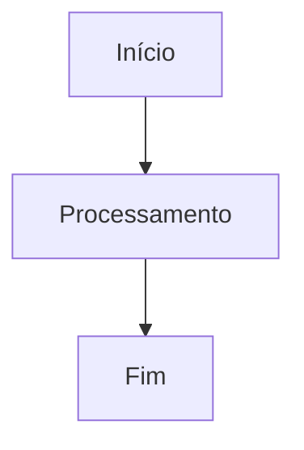
```

> `graph TD` significa um grafo de cima para baixo (**Top Down**).

---

## 1) Flowchart (fluxograma)

### Exemplo simples

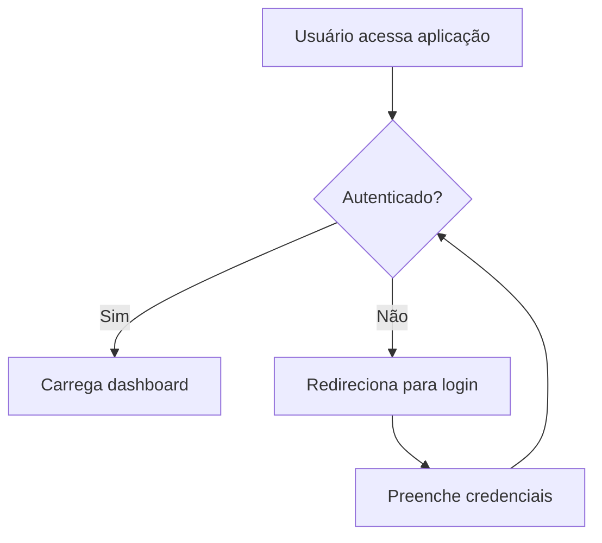

### Direções úteis

- `TD` / `TB`: Top Down (cima para baixo)
- `LR`: Left to Right (esquerda para direita)
- `RL`: Right to Left
- `BT`: Bottom to Top

### Formatos de nós

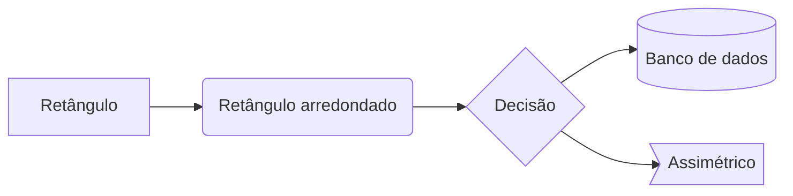

---

## 2) Sequence Diagram (sequência)

Útil para mostrar troca de mensagens entre serviços.

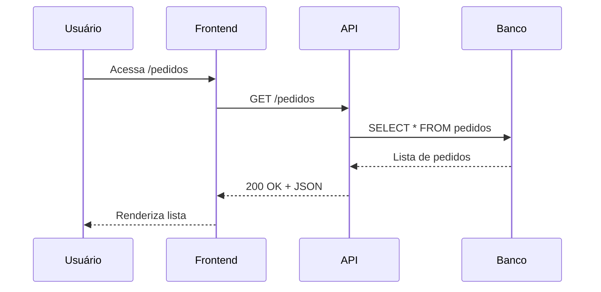

---

## 3) Class Diagram (classes)

Bom para modelagem de domínio e orientação a objetos.

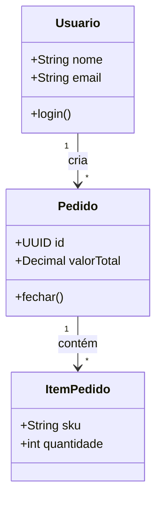

---

## 4) State Diagram (máquina de estados)

Excelente para ciclos de vida (pedido, ticket, deploy etc.).

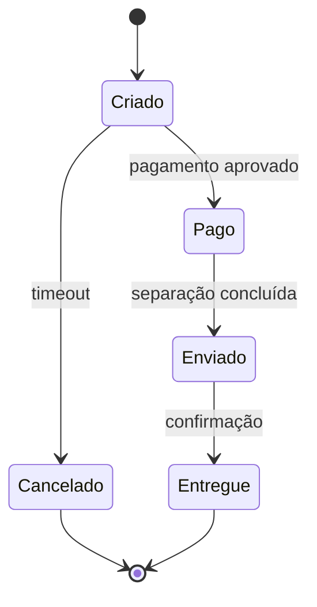

---

## 5) ER Diagram (entidade-relacionamento)

Para representar entidades e relacionamentos de banco de dados.

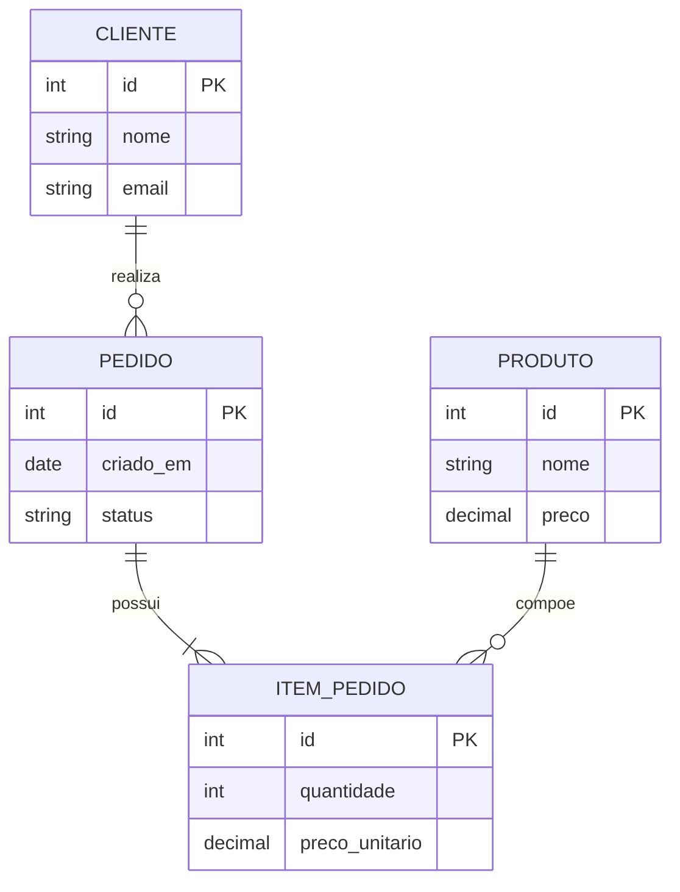

---

## 6) Gantt Chart (cronograma)

Ótimo para planejamento de projetos.

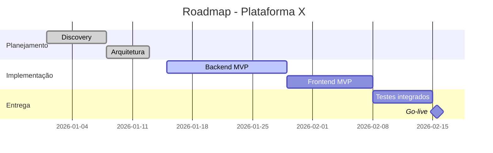

---

## 7) Journey Diagram (jornada)

Bom para experiência do usuário e processos.

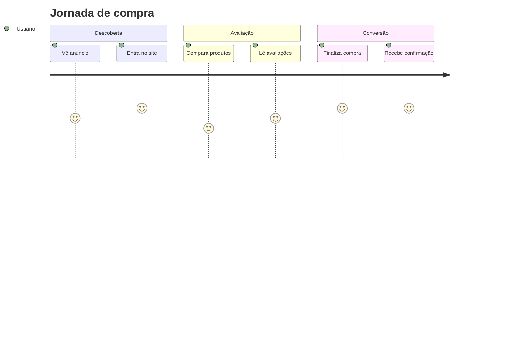

---

## 8) Pie Chart (distribuição)

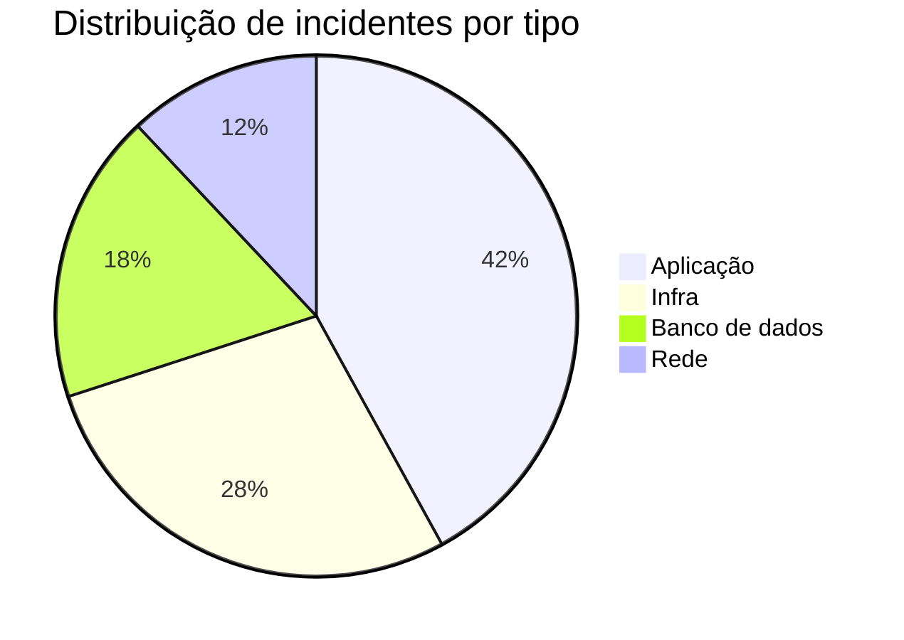

---

## 9) Mindmap (mapa mental)

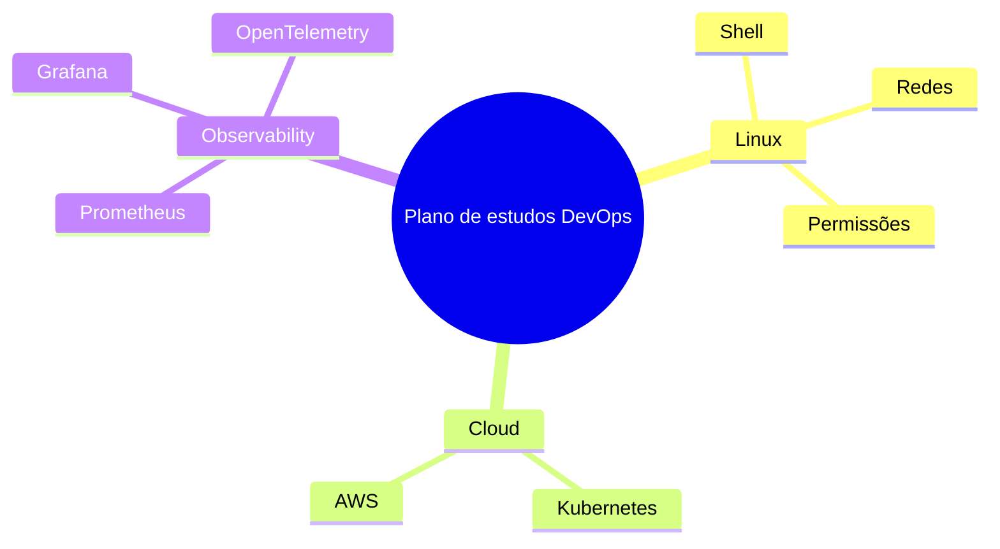

---

## 10) Git Graph (histórico de branches)

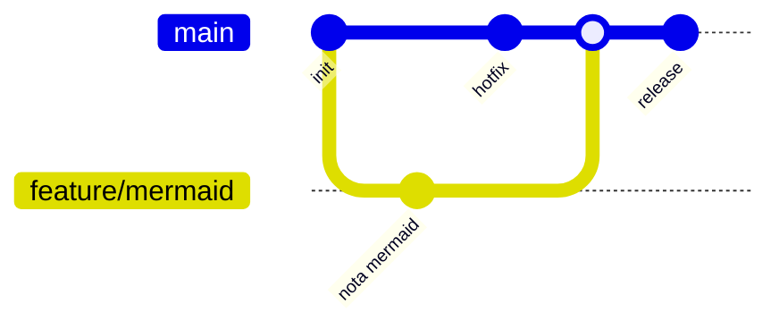

---

## Dicas de escrita

- Prefira nomes curtos nos nós.
- Divida diagramas grandes em partes menores.
- Use `subgraph` em flowchart para agrupar contextos.
- Mantenha estilo consistente (setas, idioma, nomenclatura).

Exemplo com `subgraph`:

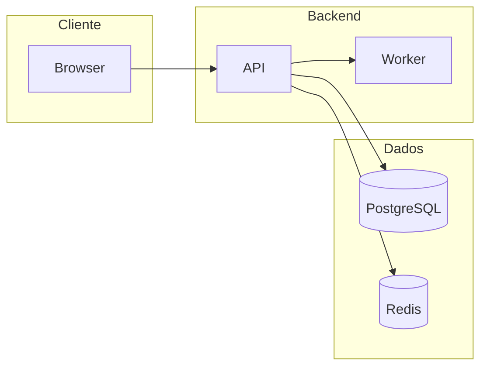

---

## Erros comuns

- Esquecer o fence de linguagem: deve ser ` ```mermaid `.
- Misturar sintaxe de tipos diferentes no mesmo bloco.
- Usar caracteres especiais sem testar (aspas e `:` em labels).
- Diagramas muito densos sem quebra por contexto.

---

## Atalho rápido (cola)

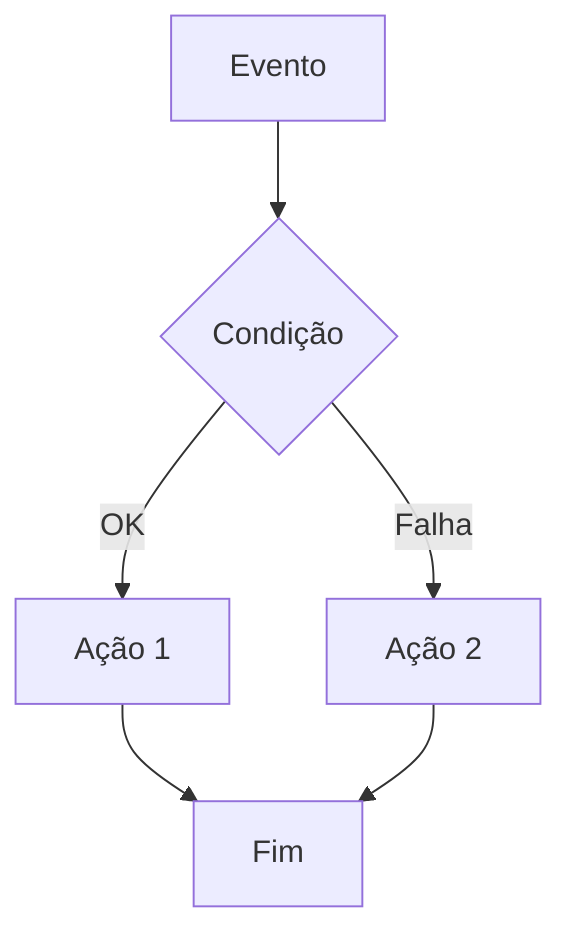

Se quiser, duplique este arquivo como template e adapte os exemplos para cada tema do seu estudo.
