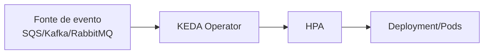

# KEDA no Kubernetes

O **KEDA** (**Kubernetes Event-driven Autoscaling**) é uma extensão de autoscaling para Kubernetes focada em **eventos externos**.

Enquanto o HPA tradicional escala por CPU e memória, o KEDA escala com base em sinais como:
- tamanho de fila (SQS, RabbitMQ, Azure Queue)
- lag de consumer (Kafka)
- métricas no Prometheus
- jobs pendentes em sistemas externos

---

## Quando usar KEDA

Use KEDA quando o tráfego da aplicação não é constante e a carga depende de eventos assíncronos.

Exemplos:
- worker que processa fila
- processador de e-mails
- consumer de eventos de streaming

Benefícios:
- escala rápida para absorver picos
- pode escalar para **zero** quando não há demanda
- reduz custo em workloads com baixa utilização contínua

---

## Como o KEDA funciona

1. Você define um `ScaledObject` apontando para um `Deployment` (ou `ScaledJob` para jobs).
2. Configura um ou mais **triggers** com limites.
3. O KEDA observa a fonte de evento e converte em métrica para o HPA.
4. O HPA ajusta réplicas do workload.

### Fluxo (desenho)



---

## Exemplo de ScaledObject

```yaml
apiVersion: keda.sh/v1alpha1
kind: ScaledObject
metadata:
  name: worker-pedidos
spec:
  scaleTargetRef:
    name: worker-pedidos
  minReplicaCount: 0
  maxReplicaCount: 20
  triggers:
    - type: aws-sqs-queue
      metadata:
        queueURL: https://sqs.us-east-1.amazonaws.com/123456789012/pedidos
        queueLength: "20"
        awsRegion: us-east-1
```

Nesse exemplo:
- se a fila crescer, o KEDA aumenta réplicas
- quando a fila esvazia, pode reduzir até `0`

---

## KEDA e Canary Deployment

O KEDA **não faz roteamento de tráfego** e **não substitui** ALB/NLB/Ingress/Service Mesh.

Ele complementa o canary assim:
- versão estável e versão canário podem ter políticas de escala independentes
- durante o canário, a versão nova pode escalar conforme carga real
- em arquiteturas assíncronas, ajuda a validar custo e performance da nova versão com segurança

Resumo:
- **canary** decide *quanto tráfego vai para cada versão*
- **KEDA** decide *quantas réplicas cada versão precisa*
