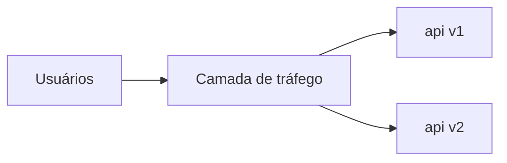

# Deployment Strategies em Kubernetes

## Definition
Deployment Strategies em Kubernetes são padrões de liberação de novas versões de aplicações, como rolling update, blue-green e canary, usados para controlar risco durante mudanças em produção.

## Why it exists
Essas estratégias existem para reduzir impacto de falhas, permitir validação gradual de novas versões e melhorar a capacidade de rollback sem interromper o serviço.

## How it works
Cada estratégia define como pods antigos e novos coexistem e como o tráfego é distribuído. Rolling update substitui instâncias gradualmente; blue-green mantém ambientes distintos e alterna o tráfego; canary envia apenas uma fração do tráfego para a nova versão antes da promoção completa.

## When to use
Use rolling update para mudanças rotineiras com baixo risco. Use blue-green quando rollback instantâneo e isolamento forem prioridade. Use canary quando quiser medir impacto real em produção antes de expandir a nova versão para toda a base de usuários.

## Examples
Um exemplo prático é publicar `api:v2` com 5% do tráfego via ingress ou service mesh. Se métricas e logs permanecerem saudáveis, a porcentagem é ampliada progressivamente até substituir `api:v1`.

## Visual Representation

## Related Notes
- [04 - Helm e Kustomize](04%20-%20Helm%20e%20Kustomize.md)
- [Rollback de deploy](../../04%20-%20Playbooks/Deploy/Rollback%20de%20deploy.md)
- [ALB vs NLB e relação com Canary Deployment](../Cloud/ALB%20vs%20NLB%20e%20Canary%20Deployment.md)
