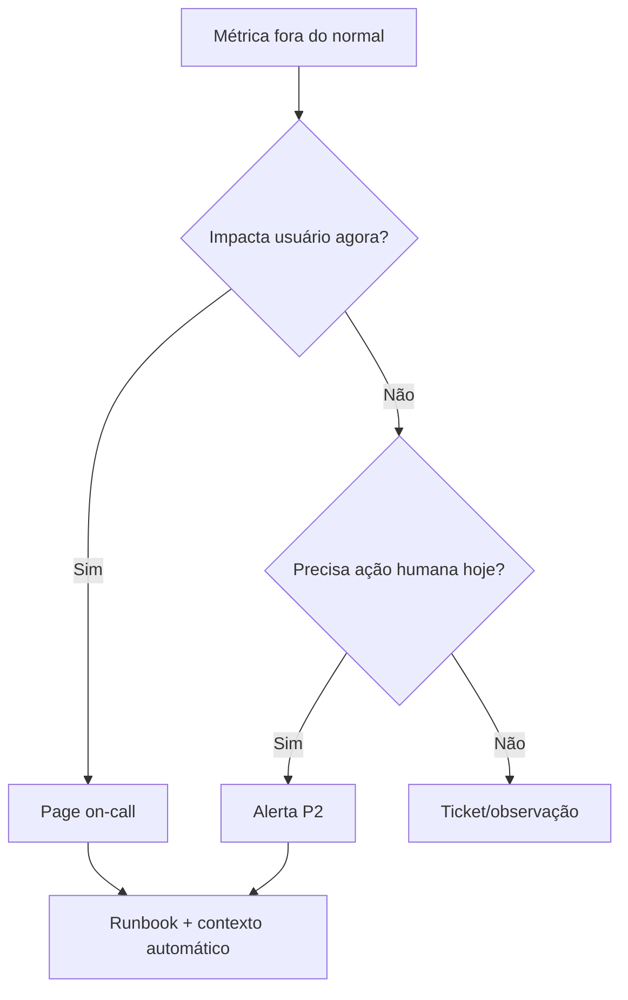
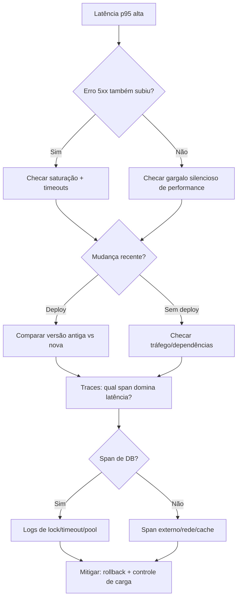

# Observabilidade aplicada ponta a ponta (da teoria ao incidente)

> Objetivo: sair do “tenho ferramentas instaladas” para “consigo detectar, diagnosticar, mitigar e aprender com incidentes reais”.

---

## 1) Fundamentos operacionais: SLI, SLO e SLA

## Definições rápidas

- **SLI (Service Level Indicator)**: métrica objetiva que mede comportamento percebido pelo usuário.
- **SLO (Service Level Objective)**: meta interna para um SLI em uma janela de tempo.
- **SLA (Service Level Agreement)**: compromisso contratual com cliente (normalmente com multa/crédito).

## Como escolher bons SLI

Um SLI bom deve ser:

- **Orientado ao usuário** (não só CPU/memória)
- **Mensurável e reproduzível**
- **Aderente ao caminho crítico** (jornada de negócio)
- **Estável ao longo do tempo** (evitar redefinir toda semana)

### Exemplos reais por tipo de sistema

### API síncrona

- **Disponibilidade**: `% de requests 2xx/3xx` sobre total válido.
- **Latência**: `p95` e `p99` por endpoint crítico (ex.: checkout).
- **Qualidade funcional**: `% de respostas semanticamente corretas` (ex.: sem fallback inválido).

### Pipeline assíncrono

- **Freshness**: atraso entre evento produzido e consumido.
- **Durabilidade**: `% de mensagens processadas sem perda`.
- **Backlog saudável**: tamanho/fila dentro de limite operacional.

### Produto com front-end

- **Web Vitals**: LCP/INP/CLS por região/dispositivo.
- **Taxa de erro JS**: erros por sessão.
- **Disponibilidade de jornada**: `% de checkouts completos`.

## Exemplo completo (e-commerce)

- **SLI 1 (latência checkout)**: p95 de `POST /checkout`.
- **SLO 1**: p95 < **400 ms** em 28 dias.
- **SLI 2 (erro checkout)**: taxa de erro 5xx em `POST /checkout`.
- **SLO 2**: erro 5xx < **0,5%** em 28 dias.
- **SLA externo**: disponibilidade mensal de **99,9%**.

## Error budget (a peça que geralmente falta)

Se seu SLO de disponibilidade é 99,9% em 30 dias, o orçamento de erro é **0,1%**:

- 30 dias ≈ 43.200 min
- 0,1% de indisponibilidade ≈ **43,2 min/mês**

Uso prático do error budget:

- Budget saudável → pode acelerar releases.
- Budget em queima rápida → priorizar confiabilidade, congelar mudanças arriscadas.

---

## 2) Estratégia de alertas (evitando alert fatigue)

## Princípios

- **Alerta é para ação humana** (se ninguém vai agir, não deve alertar).
- **Página (pager) só para impacto real ao usuário**.
- **Sintoma > causa** para detecção inicial (ex.: alta latência percebida).
- **Poucos alertas, claros e roteáveis por owner**.

## Taxonomia recomendada

- **P1 / page imediato**: indisponibilidade ou degradação grave de jornada crítica.
- **P2 / urgente horário comercial**: degradação relevante sem parada total.
- **P3 / backlog**: anomalias sem impacto perceptível.

## Modelo de alertas multi-janela (burn rate)

Combine alertas rápidos + lentos para reduzir ruído:

- **Rápido**: janela curta (5m) para detectar regressão abrupta.
- **Lento**: janela longa (1h ou 6h) para detectar degradação sustentada.

Exemplo (conceitual):

- SLO erro 0,5% (budget de 0,5%)
- Alerta crítico se:
  - erro > 5% por 5 min **e**
  - erro > 1% por 1h

Assim, você evita acordar time por “espinho” transitório.

## Checklist anti-fatigue

- Deduplicação e agrupamento por serviço/impacto.
- Supressão durante manutenção planejada.
- Enriquecimento automático no alerta:
  - dashboard
  - runbook
  - versão/deploy recente
  - owner/on-call
- Revisão mensal dos alertas:
  - quais acionaram sem incidente?
  - quais incidentes não geraram alerta?

### Fluxo de decisão (Mermaid)



---

## 3) Runbook orientado por métricas, logs e traces

## Estrutura mínima de runbook

1. **Objetivo e escopo** (qual serviço/jornada cobre)
2. **SLIs afetados** (latência, erro, saturação, backlog)
3. **Passos de triagem (5-15 min)**
4. **Hipóteses comuns + testes rápidos**
5. **Mitigação segura (rollback, feature flag, rate limit)**
6. **Critérios de escalonamento**
7. **Validação de recuperação**
8. **Pós-incidente** (postmortem e ações preventivas)

## Método de investigação por sinais

- **Métricas** dizem **o que** degradou e **quando**.
- **Logs** explicam **o que aconteceu** (erros/contexto).
- **Traces** mostram **onde** ocorreu a latência/erro na cadeia distribuída.

### Sequência operacional recomendada

```text
1) Detectar (alerta por SLO)
2) Delimitar impacto (quais clientes/regiões/endpoints)
3) Correlacionar janela temporal (deploy, tráfego, dependência)
4) Abrir trace representativo (p95/p99)
5) Pivotar para logs do span/trace_id
6) Confirmar hipótese com métrica de suporte
7) Mitigar e medir recuperação
8) Registrar timeline + aprendizados
```

## Runbook template (copiar e adaptar)

```markdown
# Runbook — [SERVIÇO] — [SINTOMA]

## Gatilho
- Alerta: [nome do alerta]
- SLO afetado: [latência/erro/disponibilidade]

## Triage inicial (até 10 min)
- Ver dashboard: [link]
- Confirmar impacto: [endpoint, região, % usuários]
- Ver mudanças recentes: [deploy, feature flag, infra]

## Hipóteses e validação
1. Hipótese A:
   - Evidência esperada em métricas:
   - Query/logs:
   - Trace esperado:
2. Hipótese B:
   ...

## Mitigação
- Opção 1 (baixo risco):
- Opção 2 (rollback):
- Critério para escalonar:

## Recuperação
- SLI voltou ao alvo por [X min]
- Erro/latência estabilizou

## Pós-incidente
- Causa raiz:
- Ação corretiva:
- Ação preventiva:
- Dono + prazo:
```

---

## 4) Caso prático: “latência alta” → hipóteses → diagnóstico por sinais

## Cenário

Alerta dispara para `POST /checkout`:

- p95 saiu de 280 ms para 1,4 s
- erro 5xx subiu de 0,2% para 1,1%
- início às 14:05, 10 min após deploy

## Hipóteses iniciais (priorizadas)

1. Regressão de aplicação após deploy.
2. Lentidão no banco (query sem índice, lock, pool esgotado).
3. Dependência externa degradada (gateway de pagamento).
4. Saturação de recursos (CPU/memória/thread pool).
5. Mudança de tráfego (pico regional/campanha).

## Diagnóstico guiado

### Passo 1 — Métricas

- Quebrou por endpoint, região e versão.
- Verificar correlação com deploy e aumento de RPS.
- Observar sinais de saturação:
  - CPU throttling
  - conexões de DB em uso
  - fila/retries

**Resultado hipotético**: versão `v2026.03.12` concentra piora + pool de DB no limite.

### Passo 2 — Traces

- Filtrar traces lentos de `POST /checkout`.
- Identificar spans dominantes.
- Comparar `v2026.03.12` vs versão anterior.

**Resultado hipotético**: span `SELECT cart_items ...` subiu de 40 ms para 900 ms.

### Passo 3 — Logs

- Buscar por `trace_id` dos traces lentos.
- Procurar timeout, lock wait, retry em cascata.

**Resultado hipotético**: `timeout acquiring DB connection` + `lock wait timeout exceeded`.

### Passo 4 — Conclusão e mitigação

- Causa provável: nova consulta sem índice + contenção de lock.
- Mitigação imediata:
  - rollback da versão
  - reduzir concorrência do endpoint (rate limit/controlado)
- Correção definitiva:
  - criar índice adequado
  - revisar plano de execução
  - ajustar pool e timeout com teste de carga

### Árvore de diagnóstico (Mermaid)



---

## 5) Tópicos que complementam a trilha (e costumam faltar)

## 5.1 Observabilidade orientada a domínio

- Defina **SLIs por jornada de negócio** (login, checkout, emissão, pagamento).
- Tenha dashboards por:
  - executivo (saúde do produto)
  - operação (SRE/on-call)
  - time de serviço (deep dive)

## 5.2 Boas práticas de instrumentação

- Padronizar atributos/chaves (`service.name`, `env`, `region`, `version`).
- Propagar `trace_id` em logs de aplicação.
- Evitar cardinalidade explosiva (IDs de usuário em labels).

## 5.3 Governança operacional

- Owner claro por serviço e por alerta.
- Escala de on-call com handoff documentado.
- Reunião de revisão semanal de incidentes e SLO.

## 5.4 Pós-incidente de verdade

- Postmortem sem culpa (blameless).
- Linha do tempo factual.
- Ações com dono, prazo e validação de eficácia.
- Atualizar alerta e runbook para evitar recorrência.

## 5.5 Maturidade (níveis)

```text
Nível 0: Ferramentas instaladas, sem SLO
Nível 1: Dashboards e alertas básicos
Nível 2: SLO + error budget + on-call
Nível 3: Runbooks consistentes + correlação métrica/log/trace
Nível 4: Engenharia de confiabilidade proativa (capacity, chaos, game days)
```

---

## 6) Plano de adoção em 30 dias

- **Semana 1**: definir 2 jornadas críticas e 2 SLIs por jornada.
- **Semana 2**: publicar SLOs, dashboards e alertas multi-janela.
- **Semana 3**: criar 1 runbook completo para “latência alta”.
- **Semana 4**: simular incidente (game day), medir MTTD/MTTR e ajustar.

## Métricas de evolução do próprio processo

- **MTTD** (tempo para detectar)
- **MTTR** (tempo para recuperar)
- **% alertas acionáveis**
- **% incidentes com runbook atualizado**
- **Recorrência de incidentes por causa raiz**

---

## 7) Referências internas úteis deste repositório

- Trilha geral de observabilidade: `02 - Guias/Observability/00 - Trilha de estudos.md`
- Prometheus (métricas): `02 - Guias/Observability/Prometheus/Introdução.md`
- OpenTelemetry (instrumentação): `02 - Guias/Observability/OpenTelemetry/OpenTelemetry.md`
- Jaeger (traces): `02 - Guias/Observability/Jaeger/Jaeger.md`
- Loki (logs): `02 - Guias/Observability/Loki/Loki.md`
- Playbook de incidente correlato: `04 - Playbooks/Incidentes/Incidente em produção - API lenta e 5xx.md`

> Dica: use este documento como “espinha dorsal” e os demais como aprofundamento por ferramenta.
