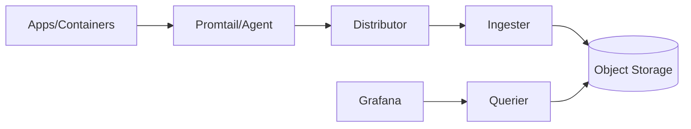

# Loki

O **Loki** é uma solução de logs criada pela Grafana Labs, otimizada para custo e simplicidade.

Diferente de outras ferramentas, ele indexa principalmente **labels** (metadados), não o texto completo de cada log. Isso reduz custo de armazenamento e ingestão.

---

## Conceitos fundamentais

### Log stream
Conjunto de logs com as mesmas labels (ex.: `{app="checkout", env="dev"}`).

### Labels
Metadados para agrupar/filtrar logs (serviço, ambiente, namespace, pod etc.).

### LogQL
Linguagem de consulta do Loki para buscar e processar logs.

### Promtail (legado) / Alloy / agentes
Agentes que coletam logs de arquivos/containers e enviam ao Loki.

---

## Quando usar Loki

- Centralizar logs de múltiplos containers/serviços.
- Investigar incidentes correlacionando logs com métricas e traces.
- Criar alertas baseados em padrões de erro.
- Reduzir custo comparado a stacks de log full-text indexing.

---

## Subindo Loki com Docker

```bash
docker run -d --name loki \
  -p 3100:3100 \
  grafana/loki:latest \
  -config.file=/etc/loki/local-config.yaml
```

Teste endpoint:

```bash
curl http://localhost:3100/ready
```

---

## Exemplo com Docker Compose (Loki + Promtail)

```yaml
services:
  loki:
    image: grafana/loki:latest
    container_name: loki
    command: -config.file=/etc/loki/local-config.yaml
    ports:
      - "3100:3100"

  promtail:
    image: grafana/promtail:latest
    container_name: promtail
    volumes:
      - /var/log:/var/log:ro
      - ./promtail-config.yaml:/etc/promtail/config.yml
    command: -config.file=/etc/promtail/config.yml
```

Subir:

```bash
docker compose up -d
```

---

## Exemplo básico de configuração do Promtail

```yaml
server:
  http_listen_port: 9080

clients:
  - url: http://loki:3100/loki/api/v1/push

scrape_configs:
  - job_name: system
    static_configs:
      - targets:
          - localhost
        labels:
          job: varlogs
          host: dev-machine
          __path__: /var/log/*.log
```

---

## Consultas LogQL úteis

### Buscar erros de um serviço
```logql
{app="checkout"} |= "ERROR"
```

### Contar erros por janela de tempo
```logql
count_over_time({app="checkout"} |= "ERROR" [5m])
```

### Taxa de logs por nível
```logql
sum by (level) (rate({app="checkout"} [1m]))
```

---

## Correlação entre logs e traces

Para investigação eficiente:
- Inclua `trace_id` nos logs da aplicação.
- Envie traces para Jaeger/Tempo.
- No Grafana, configure links de correlação (log → trace).

Assim, ao ver erro em log, você abre o trace correspondente e encontra a causa raiz com mais rapidez.

---

## Boas práticas

- Padronize labels (evita cardinalidade explosiva).
- Evite colocar valores muito variáveis como label (ex.: `user_id`).
- Estruture logs em JSON quando possível.
- Defina retenção por ambiente (dev < prod).
- Trate logs como dado de produto e operação, não “texto solto”.

---

## Como Loki se encaixa na sua trilha

No contexto deste repositório:
- Você já cobre **métricas** com Prometheus.
- Já iniciou **traces** com OpenTelemetry.
- Com Loki, fecha o pilar de **logs**.

Resultado: você passa a praticar observabilidade de forma realmente integrada.


## Arquitetura simplificada do Loki



## Jornada do log (ingestão até consulta)

```text
[Aplicacao escreve log]
        |
        v
[Agent coleta e rotula labels]
        |
        v
[Loki ingere e indexa labels]
        |
        v
[Chunks salvos no storage]
        |
        v
[Consulta LogQL no Grafana]
```
