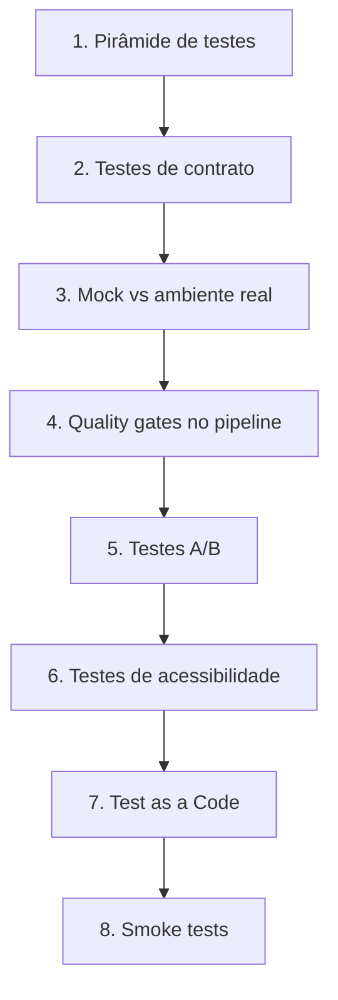

# 🧪 Trilha de Testes de Software

Esta trilha organiza os principais tópicos de teste de software em uma sequência prática de estudo e aplicação.

## Objetivos da trilha

- Entender **como distribuir testes por nível** (rápidos, médios e lentos).
- Projetar uma estratégia para sistemas **distribuídos e orientados a APIs/eventos**.
- Decidir conscientemente entre **mock** e **ambiente real** sem cair em extremos.
- Colocar qualidade como parte obrigatória da entrega via **quality gates**.
- Experimentar com confiança usando **testes A/B**.
- Incluir **acessibilidade** como requisito não funcional verificável.
- Tratar testes como produto de engenharia via **Test as a Code (TaaC)**.
- Garantir segurança mínima de release com **smoke tests**.

## Ordem sugerida de estudo

## Como usar a trilha

1. Leia a nota do tópico e extraia um **checklist aplicável ao seu contexto**.
2. Execute um experimento pequeno (ex.: um serviço, endpoint ou fluxo de UI).
3. Registre evidências: tempos de execução, falhas encontradas, instabilidades e custo de manutenção.
4. Revise a estratégia a cada sprint/release com dados reais, não apenas opinião.

## Resultado esperado

Ao fim da trilha, você deve conseguir:

- Defender uma estratégia de testes equilibrada com linguagem técnica e dados.
- Reduzir regressões sem inflar custo de execução de pipeline.
- Aumentar confiança de deploy com governança de qualidade contínua.
