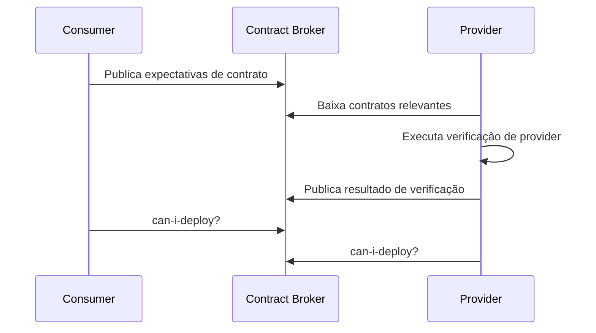

# 🤝 Testes de contrato em arquitetura distribuída

Em sistemas distribuídos, a falha mais comum não é lógica interna isolada: é **quebra de integração** entre serviços que evoluem em ritmos diferentes.

## O que é contrato

Contrato é o acordo técnico entre dois lados:

- **Estrutura de dados** (campos, tipos, obrigatoriedade)
- **Semântica** (significado de cada campo)
- **Comportamento** (status code, erros, timeouts, versionamento)

## Fluxo recomendado (consumer-driven contract)

## Estratégia prática

1. O consumidor define expectativas mínimas do payload e comportamento.
2. O provider valida automaticamente se ainda atende essas expectativas.
3. Deploy só ocorre se `can-i-deploy` indicar compatibilidade.
4. Quebras exigem versionamento (campo opcional, endpoint novo, evento v2).

## Onde contratos brilham

- APIs entre squads diferentes.
- Eventos assíncronos (Kafka, RabbitMQ, SNS/SQS).
- Migração gradual de monólito para microsserviços.

## Riscos e mitigação

- **Risco:** contrato muito rígido trava evolução.
  - **Mitigação:** diferenciar campos obrigatórios de opcionais e tolerância a campos extras.
- **Risco:** contrato sem semântica documentada.
  - **Mitigação:** exemplos canônicos + casos de erro.
- **Risco:** falsa segurança sem integração real.
  - **Mitigação:** combinar contrato + integração seletiva + poucos E2E críticos.

## Checklist mínimo

- [ ] Contratos versionados e rastreáveis por commit.
- [ ] Pipeline com etapa de verificação de provider.
- [ ] Política de compatibilidade retroativa definida.
- [ ] Bloqueio de deploy em caso de quebra incompatível.
