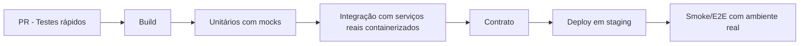

# 🎭 Estratégia de mock vs ambiente real

A decisão não é “mock ou real”, e sim **quanto de cada um em cada estágio**.

## Matriz de decisão

```ascii
+----------------------+-----------------------------+------------------------------+
| Critério             | Mock/Fake                   | Ambiente real                |
+----------------------+-----------------------------+------------------------------+
| Velocidade           | Muito alta                  | Média/baixa                  |
| Determinismo         | Alto                        | Médio (rede e infra variam)  |
| Custo de execução    | Baixo                       | Médio/alto                   |
| Fidelidade           | Média                       | Alta                         |
| Diagnóstico de falha | Fácil                       | Mais complexo                |
+----------------------+-----------------------------+------------------------------+
```

## Regra de bolso por nível

- **Unitário:** priorize mock/fake para isolamento.
- **Integração:** prefira dependências reais locais (containers de banco/fila).
- **Contrato:** mocks controlados no consumer + validação real no provider.
- **E2E/Smoke:** ambiente o mais próximo possível de produção.

## Padrão híbrido recomendado



## Cuidado com extremos

- **Mock em excesso:** gera ilusão de segurança.
- **Ambiente real em excesso:** pipeline lento, caro e instável.

## Técnicas úteis

- Virtualização de serviços para cenários raros (erro 429, timeout extremo).
- Dados sintéticos realistas para simular volumetria e cardinalidade.
- Feature flags para validar comportamento com tráfego controlado.
