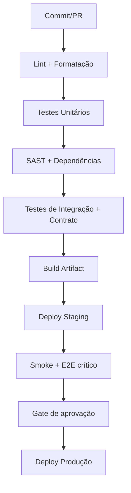

# 🚦 Qualidade em pipelines (quality gates)

Quality gates são critérios automáticos que impedem promoção de artefatos sem padrão mínimo de qualidade.

## Conceito

Um gate deve responder objetivamente: **“Pode avançar para o próximo estágio?”**

Se a resposta for não, o pipeline falha cedo com evidência clara.

## Exemplo de pipeline com gates

## Gates recomendados

### Gate de código
- Lint sem erros bloqueantes.
- Convenções e padrões arquiteturais validados.

### Gate de teste
- Sucesso dos testes obrigatórios por categoria.
- Limite aceitável de flaky tests (idealmente 0).
- Tempo máximo por etapa para evitar backlog de PR.

### Gate de segurança
- Dependências com CVE crítico bloqueiam release.
- Segredos hardcoded e imagens vulneráveis impedem promoção.

### Gate de confiabilidade
- Smoke tests pós-deploy obrigatórios.
- Regras de rollback automático com métricas (erro, latência, saturação).

## Métricas para governança

- Lead time por PR.
- Taxa de falha de pipeline por tipo de gate.
- MTTR de falhas detectadas no pipeline.
- Escape rate (bugs que chegaram em produção).

## Boas práticas

- Gates curtos em PR; profundos em main/release.
- Mensagens de falha acionáveis (o que quebrou e como corrigir).
- Revisão periódica dos gates para evitar burocracia improdutiva.
