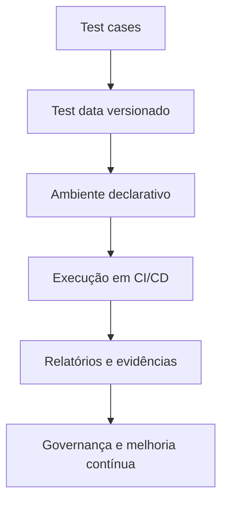

# 🧩 Test as a Code (TaaC)

Test as a Code trata estratégia, dados, ambientes e execução de testes como artefatos versionados e auditáveis.

## Princípios

- Versionamento no mesmo fluxo de código da aplicação.
- Revisão por pull request para mudanças de teste.
- Reprodutibilidade local e em CI com infraestrutura declarativa.
- Observabilidade da suíte (tempo, flakiness, tendência de falha).

## Componentes de TaaC

## Benefícios

- Reduz dependência de conhecimento tácito em pessoas específicas.
- Facilita onboarding e troubleshooting de falhas intermitentes.
- Permite rastreabilidade entre requisito, teste e incidente em produção.

## Implementação incremental

1. Padronize estrutura de diretórios e naming de testes.
2. Crie datasets mínimos e sintéticos por cenário.
3. Defina “test environments as code” com containers/compose/manifests.
4. Publice relatórios versionados por execução (artefatos CI).
5. Estabeleça SLO da suíte (tempo máximo, taxa de flake, confiabilidade).

## Anti-padrões

- Teste crítico fora do repositório (planilha/execução manual sem rastreio).
- Dependência de massa de dados compartilhada e mutável entre pipelines.
- Falha sem evidência (sem log, sem trace, sem screenshot quando aplicável).
