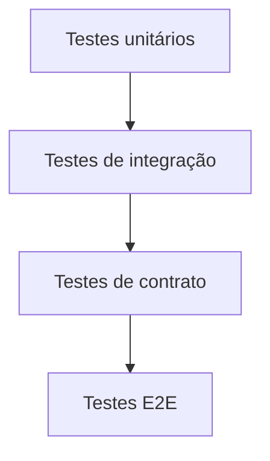

# Testes

## Definition
Testes são práticas de verificação automatizada ou manual usadas para validar comportamento, prevenir regressões e aumentar confiança na evolução de software.

## Why it exists
Eles existem para detectar erros cedo, reduzir custo de falha em produção e dar segurança para refatoração, deploy contínuo e mudanças frequentes.

## How it works
A estratégia combina diferentes níveis, como testes unitários, integração, contrato, acessibilidade e E2E. Cada nível cobre um tipo de risco e precisa ser usado de forma equilibrada para evitar custo alto com baixa cobertura útil.

## When to use
Use em qualquer projeto de software, ajustando profundidade e automação conforme criticidade, frequência de mudança e impacto de falhas. Sistemas distribuídos e pipelines frequentes se beneficiam ainda mais de uma estratégia clara de testes.

## Examples
Um exemplo prático é validar regra de negócio com testes unitários, integração com banco em ambiente controlado e contrato entre serviços antes do deploy. Isso reduz regressões tanto no código quanto nas integrações.

## Visual Representation

## Related Notes
- [00 - Trilha de Testes de Software](00%20-%20Trilha%20de%20Testes%20de%20Software.md)
- [01 - Pirâmide de testes (unitário, integração, contrato, E2E)](01%20-%20Pir%C3%A2mide%20de%20testes%20(unit%C3%A1rio%2C%20integra%C3%A7%C3%A3o%2C%20contrato%2C%20E2E).md)
- [04 - Qualidade em pipelines (quality gates)](04%20-%20Qualidade%20em%20pipelines%20(quality%20gates).md)
