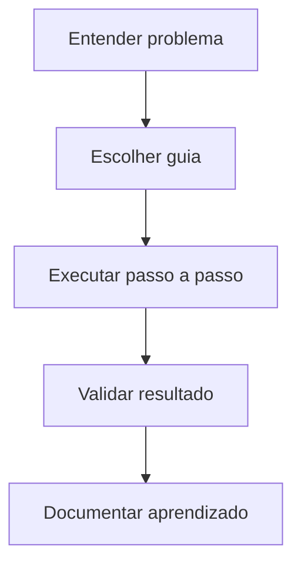

# 🛠️ Índice — Guias

A pasta **Guias** reúne materiais orientados à execução prática.



```text
Problema?
  |
  +--> Guia prático --> Execução --> Validação --> Registro
```


## Objetivo

- Transformar conceitos em implementação.
- Oferecer passo a passo para ferramentas e fluxos reais.
- Ajudar na aplicação direta no dia a dia técnico.

## O que você encontra aqui

- Docker
- Kubernetes
- CI/CD
- Testes de Software
- Terraform
- Observability
- Cloud
- Git
- Mensageria

## Quando usar esta seção

Use esta pasta quando você já entende o básico e quer montar, configurar ou operar algo de forma prática.