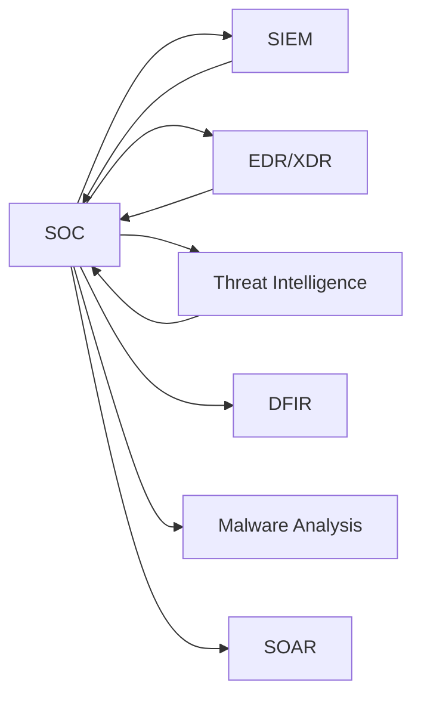

Um **SOC** (_Security Operations Center_ ou Centro de Operações de Segurança) é o **coração da defesa cibernética** de uma organização.  
É um **time + ambiente + processo** dedicado a **monitorar, detectar, analisar e responder a ameaças** 24/7.

Pensa nele como uma **sala de controle** (tipo NASA), mas para segurança digital.

---

### ⚙️ **Funções de um SOC**

1. **Monitoramento Contínuo**
    
    - Usa ferramentas como **SIEM** (Splunk, ELK, Wazuh, Sentinel) para coletar logs de toda a infraestrutura.
        
    - Gera alertas quando detecta comportamento anômalo.
        
2. **Detecção de Incidentes**
    
    - Correlaciona eventos para encontrar ataques reais (evitando falsos positivos).
        
    - Identifica ataques como phishing, ransomware, brute force, etc.
        
3. **Resposta a Incidentes**
    
    - Contém ataques rapidamente (isolando máquinas, bloqueando IPs, resetando credenciais).
        
    - Escala para times de DFIR quando necessário.
        
4. **Análise e Investigação**
    
    - Faz _triagem_ dos alertas, determina impacto, busca origem do ataque.
        
    - Usa dados de **Threat Intelligence** para entender se é uma ameaça conhecida.
        
5. **Melhoria Contínua**
    
    - Ajusta regras de detecção.
        
    - Propõe melhorias de segurança para evitar incidentes futuros.
        

---

### 👥 **Papéis Comuns em um SOC**

- **SOC Analyst Nível 1 (L1)**
    
    - Primeira linha de defesa, monitora alertas e faz triagem básica.
        
- **SOC Analyst Nível 2 (L2)**
    
    - Investiga incidentes mais complexos, correlaciona dados e inicia mitigação.
        
- **SOC Analyst Nível 3 (L3) / Incident Responder**
    
    - Atua em casos graves, faz análise profunda (DFIR), coordena resposta.
        
- **Threat Hunter**
    
    - Proativo: procura sinais de ataques mesmo quando não há alertas.
        
- **SOC Manager**
    
    - Lidera o time, garante processos e métricas de desempenho.
        

---

### 🛠️ **Ferramentas usadas em um SOC**

- **SIEM:** Splunk, ELK, Wazuh, Microsoft Sentinel.
    
- **EDR/XDR:** CrowdStrike, SentinelOne, Microsoft Defender for Endpoint.
    
- **SOAR:** TheHive, Cortex, Phantom (automatização de resposta).
    
- **Threat Intelligence:** MISP, OpenCTI, VirusTotal.
    
- **Forense:** Volatility, Autopsy, Wireshark.
    

---

### 🔗 Como SOC se conecta ao resto

- O **SOC** abriga o **Blue Team**.
    
- O **SOC** aciona o **DFIR** quando um incidente é confirmado.
    
- O **SOC** consome **Threat Intelligence** para melhorar detecção.
    
- O **SOC** pode enviar amostras suspeitas para **Malware Analysis**.
    

Ou seja: **SOC é onde tudo acontece e se integra**.

---

### 🧭 Fluxo operacional de um SOC

```text
[Coleta de logs]
      |
      v
[SIEM gera alerta]
      |
      v
[Triage L1]
  |        \
  |         \--> [Falso positivo] --> [Ajuste de regra]
  v
[Investigação L2]
      |
      v
[Incidente confirmado?] -- não --> [Encerrar com documentação]
      |
     sim
      v
[Resposta L3 / IR]
      |
      +--> [Conter: isolar host, bloquear IOC, resetar credenciais]
      |
      +--> [Erradicar: remover persistência/malware]
      |
      +--> [Recuperar: restaurar serviço]
      v
[Lições aprendidas + melhoria contínua]
```

### 🏗️ Integração SOC com outras frentes


