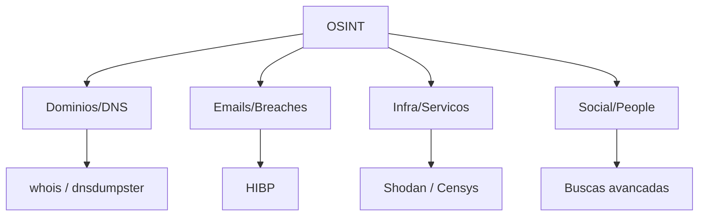

# 🕵️ OSINT - Open Source Intelligence  

**OSINT** (Inteligência de Fontes Abertas) é o processo de **coletar, analisar e usar informações disponíveis publicamente** para produzir conhecimento útil.  
Essas informações podem vir de qualquer fonte pública ou acessível legalmente.  

---

## 📌 O que é considerado "Fonte Aberta"?
- Internet (sites, blogs, redes sociais, fóruns)  
- Registros públicos (governos, empresas, WHOIS, tribunais)  
- Mídia (jornais, rádio, TV)  
- Documentos acadêmicos e científicos  
- Metadados de arquivos públicos  
- Imagens e vídeos disponibilizados na web  

---

## 🎯 Objetivos do OSINT
- Investigações de segurança cibernética  
- Monitoramento de ameaças  
- Contrainteligência  
- Investigação criminal e jornalismo investigativo  
- Análise de reputação de empresas ou pessoas  

---

## ⚙️ Exemplos de Técnicas
- **Footprinting**: levantamento de informações iniciais sobre alvos.  
- **WHOIS Lookup**: consultar informações sobre domínios.  
- **Reverse Image Search**: descobrir a origem ou reutilização de imagens.  
- **Social Media OSINT**: mapear perfis, conexões e publicações.  
- **Geolocalização**: identificar locais a partir de imagens/vídeos.  

---

## 🛠️ Ferramentas Comuns
- **Maltego** → análise de relacionamentos entre pessoas, domínios e empresas.  
- **Shodan** → busca por dispositivos conectados na Internet.  
- **theHarvester** → coleta de e-mails e subdomínios.  
- **Recon-ng** → framework para automação de OSINT.  
- **SpiderFoot** → varredura automatizada de fontes abertas.  
- **Google Dorks** → uso avançado de buscas no Google.  

---

## ⚠️ Considerações Éticas e Legais
- OSINT só deve usar **informações públicas e acessíveis legalmente**.  
- A prática de **invadir sistemas** ou **acessar dados privados** não é OSINT (já entra em intrusão/hacking ilegal).  
- Muitas organizações usam OSINT como parte de **threat intelligence** e **red/blue teaming**.  

---


## Pipeline OSINT (visão prática)

```text
[Definir alvo + objetivo]
           |
           v
[Coleta passiva de fontes publicas]
           |
           v
[Normalizacao e correlacao]
           |
           v
[Validacao de evidencias]
           |
           v
[Relatorio com riscos e acoes]
```

## Fontes e ferramentas por categoria


