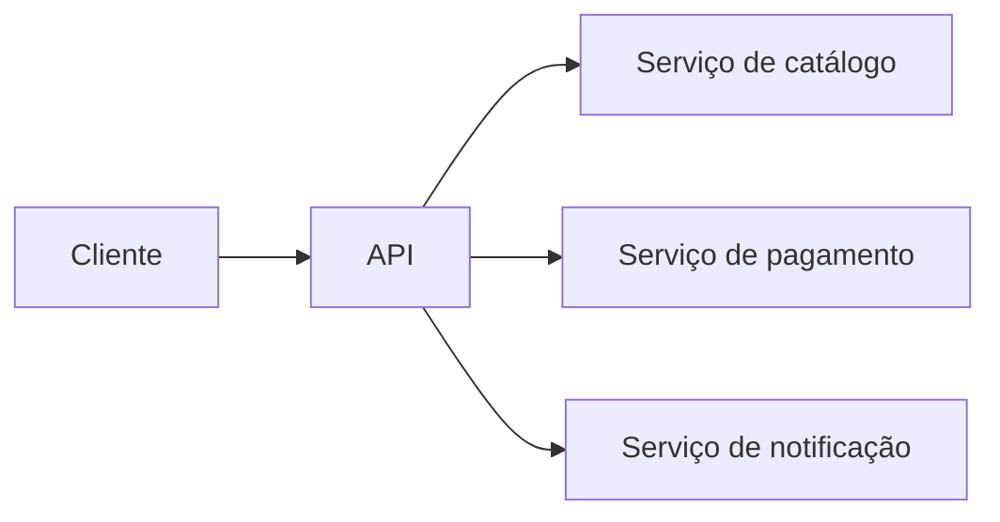

# Sistemas distribuídos

## Definition
Sistemas distribuídos são conjuntos de componentes independentes que cooperam por rede para executar uma solução única, mesmo estando em processos, máquinas ou zonas diferentes.

## Why it exists
Eles existem para permitir escala horizontal, isolamento de falhas, especialização de serviços e operação em ambientes onde uma única máquina não é suficiente.

## How it works
Os componentes trocam mensagens por protocolos de rede e precisam lidar com latência, falhas parciais, consistência, descoberta de serviços, retries e observabilidade. Como não compartilham memória local, coordenação e contratos entre serviços se tornam parte essencial do design.

## When to use
Use quando houver necessidade real de escalar partes do sistema de forma independente, separar responsabilidades de domínio ou aumentar resiliência operacional. Evite quando a complexidade adicional superar os ganhos de negócio.

## Examples
Um exemplo prático é um e-commerce com serviços separados para catálogo, pagamento e notificação. Cada serviço pode escalar de forma independente, mas precisa de contratos, filas, timeouts e monitoramento para operar corretamente em conjunto.

## Visual Representation

## Related Notes
- [Concorrência](../../01%20-%20Fundamentos/Programa%C3%A7%C3%A3o/Fundamentos/concorrencia.md)
- [Retries e timeouts](../../01%20-%20Fundamentos/Programa%C3%A7%C3%A3o/Fundamentos/retries-e-timeouts.md)
- [Observabilidade](../../01%20-%20Fundamentos/Programa%C3%A7%C3%A3o/Fundamentos/observabilidade.md)
