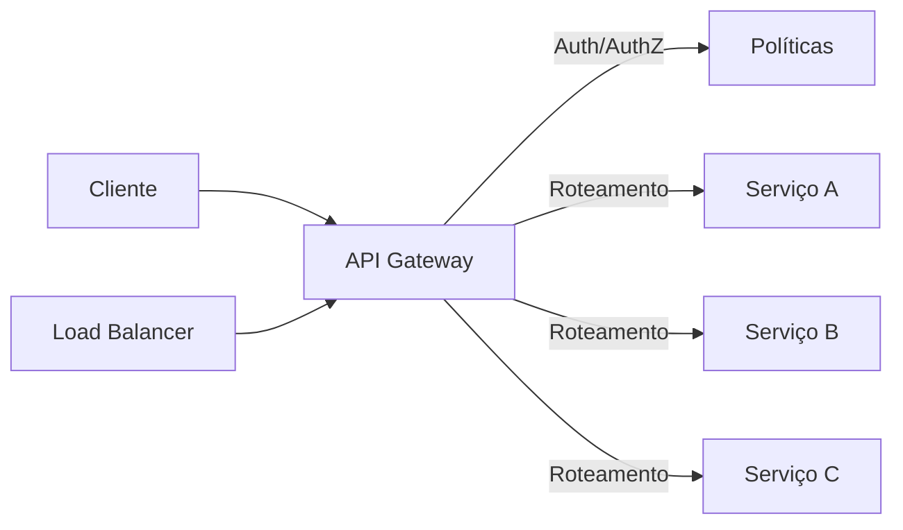

# API Gateway

## Definição
API Gateway é a camada de entrada única para clientes que consomem múltiplos serviços de backend. Ele centraliza políticas transversais como autenticação, autorização, rate limiting, throttling, roteamento, observabilidade e, em alguns casos, transformação de payload.

## Porque iso existe
Em arquiteturas com microservices, expor cada serviço diretamente para internet cria problemas de segurança, acoplamento e governança. API Gateway existe para resolver:

- Superfície de ataque maior quando vários serviços ficam públicos
- Duplicação de lógica de auth, limites e logs em cada serviço
- Dificuldade de evoluir contratos de API sem quebrar clientes
- Complexidade para clientes orquestrarem várias chamadas
- Falta de padronização de políticas de tráfego

## Como funciona
O cliente chama o API Gateway e não os serviços internos diretamente. O gateway aplica políticas, decide o destino da requisição e encaminha para upstreams.

Fluxo típico:

1. Cliente envia requisição HTTPS para o gateway
2. Gateway valida identidade (ex: JWT, OAuth2 token, API Key)
3. Gateway aplica autorização por rota/escopo
4. Gateway aplica rate limit e throttling
5. Gateway roteia para o serviço correto
6. Gateway registra métricas, logs e traces
7. Gateway devolve resposta (eventualmente agregada)

Principais funcionalidades:

- AuthN (autenticação): valida quem é o consumidor
- AuthZ (autorização): valida o que esse consumidor pode acessar
- Rate limit: controla quantidade de requisições por janela (ex: 100 req/min por cliente)
- Throttling: desacelera ou bloqueia tráfego quando há excesso momentâneo para proteger o sistema
- Roteamento: direciona caminhos/hosts para serviços específicos
- TLS termination: encerra TLS no gateway, simplificando certificado nos serviços internos
- Observabilidade: centraliza logs de acesso, latência, códigos HTTP e tracing distribuído
- Transformação: pode adaptar headers, paths e formatos para compatibilidade
- Caching: reduz latência e carga em endpoints de leitura

### Auth no API Gateway
O gateway normalmente integra com um Identity Provider (IdP) e valida tokens antes de encaminhar tráfego. Padrões comuns:

- JWT assinado: valida assinatura, expiração, issuer e audience
- OAuth2/OIDC: valida access token e escopos
- API Keys: identifica consumidor para planos e limites
- mTLS: autenticação de cliente com certificado em cenários B2B/alta segurança

Boa prática: o gateway valida credenciais e repassa claims relevantes para o backend via headers internos confiáveis.

### Rate limit x Throttling
Embora relacionados, não são iguais:

- Rate limit define um teto por período (política de consumo)
- Throttling reage à pressão de tráfego e protege capacidade (política de proteção)

Exemplo prático:

- Plano Basic: 60 req/min por API Key (rate limit)
- Se pico instantâneo passar de 20 req/s por 5 segundos, gateway responde 429 temporariamente (throttling)

### Relação com Load Balancer
API Gateway e Load Balancer podem coexistir, mas têm responsabilidades diferentes:

- Load Balancer distribui conexões/requisições entre múltiplas instâncias
- API Gateway aplica políticas de API e segurança na borda

Topologias comuns:

1. Internet -> Load Balancer L4 -> API Gateway -> Services
   - L4 distribui conexões TCP para múltiplas réplicas do gateway
2. Internet -> API Gateway (gerenciado) -> Load Balancer interno -> Services
   - Gateway trata políticas e LB interno distribui para pods/VMs

Resumo: Load Balancer otimiza distribuição e disponibilidade; API Gateway otimiza governança e segurança de APIs.

## Quando usar
Use API Gateway quando houver um ou mais destes cenários:

- Múltiplos serviços expostos para clientes externos
- Necessidade de auth centralizada e padronizada
- Controle por plano de consumo (free/pro/enterprise)
- Necessidade de observabilidade unificada na borda
- Versionamento e evolução de APIs com menor impacto em clientes
- Estratégias de proteção contra abuso e picos

Evite usar gateway muito “inteligente” com regra de negócio de domínio. Regra de negócio deve permanecer nos serviços.

## Exemplos
Exemplo 1: Plataforma SaaS multi-tenant

- Cada tenant usa API Key própria
- Gateway aplica rate limit por tenant
- Rotas administrativas exigem escopo admin no token
- Picos de um tenant não derrubam os demais por políticas de isolamento

Exemplo 2: App mobile com backend em microservices

- App chama um endpoint agregado no gateway
- Gateway autentica usuário e chama serviços de perfil, pedidos e pagamentos
- Cliente reduz chattiness e simplifica integração

Exemplo 3: Proteção de APIs públicas

- Gateway aplica WAF, throttling e limite por IP/chave
- Requisições suspeitas recebem 401/403/429 rapidamente
- Backend interno permanece menos exposto

## Representação visual

## Notas Relacionadas
- [Load Balancer](../Load Balancer/Load Balancer.md)
- [Nginx e Reverse Proxy](../../DevOps/Nginx e Reverse Proxy.md)
