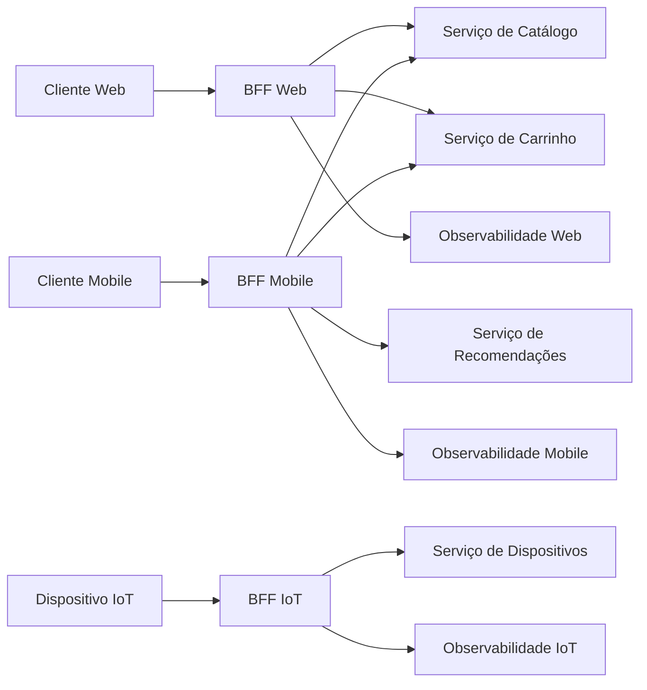

# BFF

## Definição
BFF, ou Backend for Frontend, é um pattern de engenharia em que existe uma camada de backend adaptada para um canal específico de consumo, como web, mobile, desktop, smartwatch, TV ou IoT.

Em vez de todos os clientes consumirem exatamente a mesma API genérica, cada canal pode ter um backend próprio, com contrato, regras de composição, formato de resposta, política de cache e observabilidade ajustados às necessidades daquele cliente.

O ponto central do BFF não é duplicar regra de negócio de domínio. O objetivo é adaptar a experiência de consumo da API para cada tipo de frontend, mantendo regras centrais nos serviços de domínio.

## Porque iso existe
BFF existe porque clientes diferentes raramente precisam da mesma API da mesma forma.

Um app mobile pode precisar de payload menor, cache mais agressivo e menos round-trips por causa de rede instável. Uma aplicação web pode aceitar respostas maiores, usar estratégias de cache diferentes e renderizar telas com mais dados simultâneos. Um dispositivo IoT pode ter limitação de processamento, conectividade intermitente e necessidade de endpoints extremamente simples.

Sem BFF, surgem problemas comuns:

- APIs genéricas demais, que retornam campos desnecessários para vários canais.
- Frontends fazendo muitas chamadas para montar uma única tela.
- Regras condicionais espalhadas no frontend para lidar com limitações de canal.
- Backend central cheio de `if canal == mobile`, `if canal == web` e variações de contrato.
- Dificuldade de medir latência, erros, cache hit rate e adoção por canal.
- Evolução lenta, porque uma mudança pensada para mobile pode afetar web, desktop ou parceiros externos.

A vantagem do pattern é permitir personalização por canal: regras de apresentação, agregação de dados, tempo de cache, quantidade de campos no response, versionamento e monitoramento exclusivo podem evoluir de forma independente.

## Como funciona
Um BFF fica entre o frontend e os serviços internos. O cliente chama o BFF específico do seu canal, e o BFF chama APIs internas, bancos de leitura, caches ou filas conforme necessário para montar uma resposta otimizada.

Fluxo típico:

1. Cliente web, mobile ou IoT faz uma requisição para seu BFF.
2. O BFF autentica ou propaga a identidade do usuário.
3. O BFF chama serviços internos necessários para aquela tela ou caso de uso.
4. O BFF agrega, filtra, transforma e ordena os dados.
5. O BFF aplica políticas específicas do canal, como TTL de cache, timeout, fallback e campos retornados.
6. O BFF registra métricas, logs e traces com dimensão de canal.
7. O cliente recebe uma resposta próxima do formato que precisa renderizar.

Responsabilidades adequadas para um BFF:

- Composição de chamadas para reduzir chattiness do frontend.
- Transformação de DTOs para modelos específicos de tela.
- Remoção de campos desnecessários para reduzir payload.
- Adaptação de cache por canal.
- Controle de timeouts e fallbacks adequados à experiência do cliente.
- Feature flags por canal.
- Observabilidade segmentada por web, mobile, desktop ou IoT.
- Versionamento e compatibilidade de contratos para clientes com ciclos de atualização diferentes.

Responsabilidades que devem ser evitadas no BFF:

- Regra de negócio central do domínio.
- Validações críticas de invariantes do sistema.
- Acesso indiscriminado ao banco transacional de outros serviços.
- Duplicação de lógica que deveria estar em serviços internos.
- Orquestrações muito longas que transformam o BFF em um monólito de integração.

A fronteira saudável é: o serviço de domínio decide o que é verdadeiro para o negócio; o BFF decide como entregar essa informação para um canal específico.

## Quando usar
Use BFF quando houver diferenças reais entre canais de consumo e essas diferenças começarem a gerar complexidade no frontend ou nas APIs compartilhadas.

Bons cenários:

- Web e mobile precisam de respostas diferentes para a mesma jornada.
- Mobile precisa reduzir chamadas por tela para melhorar latência percebida.
- Clientes têm ciclos de release diferentes, como web com deploy contínuo e mobile dependente de atualização em app store.
- É necessário medir disponibilidade, latência, erro e cache por canal.
- O mesmo domínio atende experiências muito diferentes, como painel administrativo, aplicativo de consumidor e dispositivo IoT.
- Há necessidade de cache com TTL diferente por canal.
- Um frontend precisa de agregação de vários serviços internos em um contrato simples.

Evite BFF quando:

- Existe apenas um cliente simples consumindo a API.
- As diferenças entre canais são pequenas e podem ser resolvidas com query parameters, sparse fields ou versionamento simples.
- A equipe não tem capacidade de operar mais um serviço em produção.
- A organização tende a colocar regra de negócio em qualquer camada intermediária.
- O problema real é falta de contrato claro entre frontend e backend, não necessidade de adaptação por canal.

Critério prático: crie um BFF quando a personalização por canal reduzir complexidade total do sistema. Não crie apenas para seguir arquitetura da moda.

## Exemplos
Exemplo 1: tela inicial de e-commerce

Um app mobile precisa renderizar a home com dados de usuário, banners, carrinho e recomendações. Sem BFF, o app faria várias chamadas:

- `GET /users/me`
- `GET /banners?channel=mobile`
- `GET /cart/current`
- `GET /recommendations`

Com BFF mobile, o app chama apenas:

```http
GET /mobile/home
```

E recebe uma resposta já ajustada:

```json
{
  "userName": "Ana",
  "cartItems": 2,
  "heroBanner": {
    "title": "Ofertas para você",
    "imageUrl": "https://cdn.example.com/mobile/banner.png"
  },
  "recommendations": [
    {
      "id": "p-123",
      "name": "Fone Bluetooth",
      "price": 199.9
    }
  ]
}
```

O BFF web poderia retornar mais campos, mais recomendações e banners em resoluções diferentes. O BFF mobile poderia usar payload menor e TTL de cache mais curto para carrinho, mas mais longo para banners.

Exemplo 2: BFF com Spring Boot para adaptar resposta por canal

```java
@RestController
@RequestMapping("/mobile/home")
class MobileHomeController {

    private final UserClient userClient;
    private final CartClient cartClient;
    private final RecommendationClient recommendationClient;

    MobileHomeController(
            UserClient userClient,
            CartClient cartClient,
            RecommendationClient recommendationClient) {
        this.userClient = userClient;
        this.cartClient = cartClient;
        this.recommendationClient = recommendationClient;
    }

    @GetMapping
    MobileHomeResponse getHome(@AuthenticationPrincipal UserPrincipal user) {
        UserSummary userSummary = userClient.getSummary(user.id());
        CartSummary cart = cartClient.getCurrentCart(user.id());
        List<ProductCard> recommendations = recommendationClient
                .getRecommendations(user.id(), 5)
                .stream()
                .map(product -> new ProductCard(product.id(), product.name(), product.price()))
                .toList();

        return new MobileHomeResponse(
                userSummary.firstName(),
                cart.itemsCount(),
                recommendations
        );
    }
}
```

Nesse exemplo, o BFF mobile não decide regra de preço, disponibilidade ou elegibilidade de produtos. Ele apenas compõe dados e devolve um contrato adequado para a tela mobile.

Exemplo 3: observabilidade por canal

Um BFF permite painéis separados como:

- Latência p95 do BFF mobile.
- Taxa de erro do BFF web.
- Cache hit rate de banners no BFF mobile.
- Quantidade de usuários impactados por falha no BFF desktop.
- Timeouts por dependência interna para cada canal.

Essa separação ajuda a evitar diagnósticos genéricos como “a API está lenta”, substituindo por perguntas melhores: “o mobile está lento porque o endpoint de recomendações aumentou p95 depois da versão 4.8?”.

## Representação visual


## Notas Relacionadas
- [API Gateway](../API Gateway/API Gateway.md)
- [Cache](../../../01 - Fundamentos/Programação/Fundamentos/cache.md)
- [Contratos de API](../../../01 - Fundamentos/Programação/Fundamentos/contratos-de-api.md)
- [Observabilidade](../../../01 - Fundamentos/Programação/Fundamentos/observabilidade.md)
