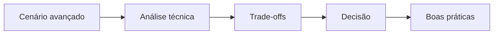

# 🔬 Índice — Deep Dives

A pasta **Deep Dives** é dedicada a análises mais profundas de temas técnicos.



```text
[Cenário] => [Análise] => [Decisão]
                 ||
            [Riscos x Custos]
```


## Objetivo

- Explorar detalhes de arquitetura, segurança e operação.
- Entender trade-offs, riscos e decisões técnicas.
- Conectar teoria com cenários avançados.

## O que você encontra aqui

- Cibersegurança
- DevOps
- Sistemas distribuídos

## Quando usar esta seção

Use esta pasta quando quiser ir além do "como fazer" e entender o "por que" de cada decisão.