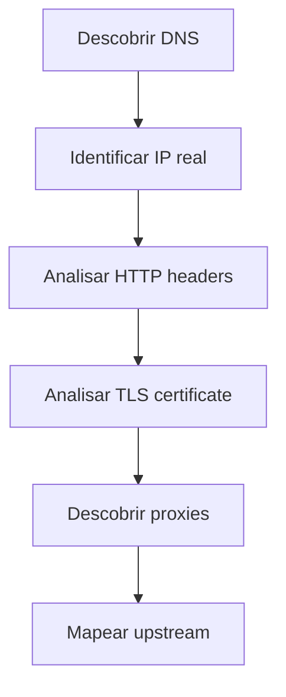
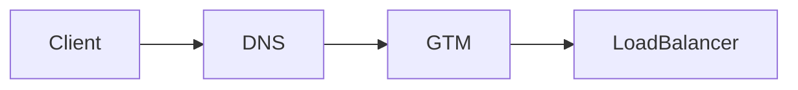
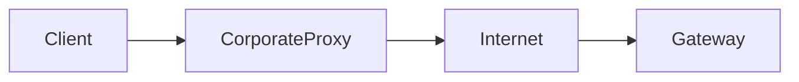
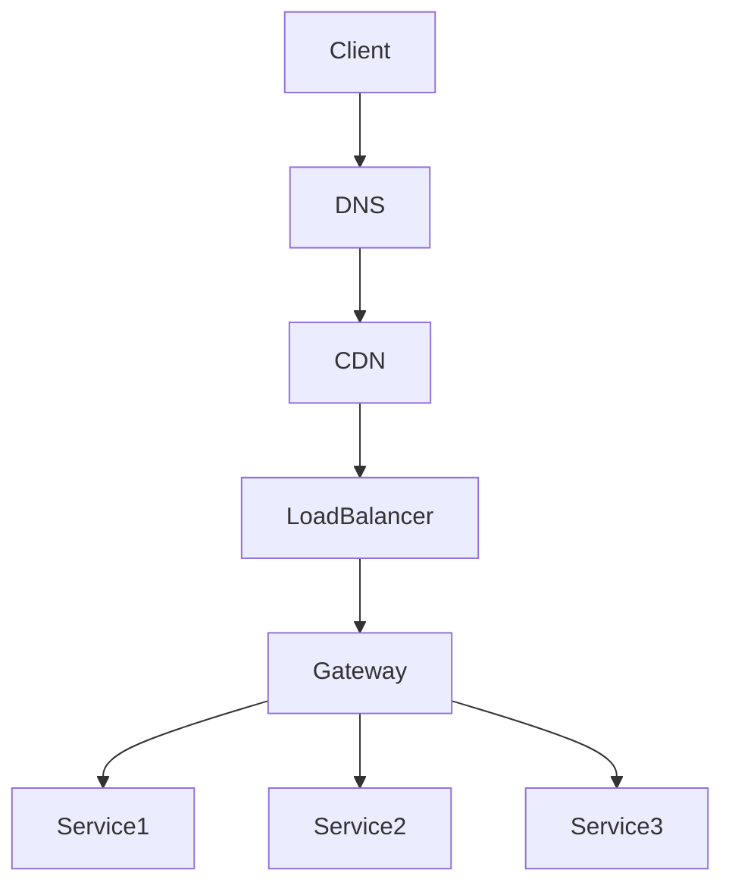

# Objetivo

Este playbook mostra como **descobrir a arquitetura de praticamente
qualquer serviço web** usando apenas ferramentas padrão do Linux.

Com esses comandos é possível identificar:

-   DNS routing
-   load balancers
-   proxies
-   API gateways
-   service mesh
-   CDNs
-   upstream services

Ferramentas usadas:

    dig
    curl
    openssl
    traceroute
    ss
    tcpdump

------------------------------------------------------------------------

# Visão geral da investigação



------------------------------------------------------------------------

# Passo 1 --- Descobrir DNS

Primeiro descubra **para onde o domínio aponta**.

``` bash
dig host.com
nslookup host.com
```

### Exemplos de sinais

  Resultado DNS               Interpretação
  --------------------------- -------------------
  CNAME → elb.amazonaws.com   AWS Load Balancer
  CNAME → cloudfront.net      CDN AWS
  CNAME → cloudflare.com      Cloudflare proxy
  IPs privados                serviço interno

Exemplo:

    api.company.com
       CNAME gateway.gtm.company.com
       CNAME internal-lb.elb.amazonaws.com

Arquitetura:



------------------------------------------------------------------------

# Passo 2 --- Descobrir o IP real

Às vezes precisamos ver o IP final.

``` bash
dig +short host.com
```

Ou:

``` bash
nslookup host.com
```

Isso revela:

    load balancers
    IPs privados
    IPs públicos

------------------------------------------------------------------------

# Passo 3 --- Inspecionar HTTP

Agora analisamos **headers HTTP**.

``` bash
curl -v https://host
```

Headers importantes:

  Header                          Significado
  ------------------------------- ------------------------
  server: nginx                   nginx gateway
  server: envoy                   envoy proxy
  server: cloudflare              CDN
  via                             proxies intermediários
  x-forwarded-for                 proxy forwarding
  x-envoy-upstream-service-time   backend interno

Exemplo:

    server: envoy
    x-envoy-upstream-service-time: 24

Isso indica:

    Envoy reverse proxy

------------------------------------------------------------------------

# Passo 4 --- Identificar redirects

``` bash
curl -vkI https://host
```

Se existir:

    HTTP 301
    Location: https://novo-host

Então existe:

    redirect HTTP

Caso contrário:

    roteamento interno

------------------------------------------------------------------------

# Passo 5 --- Inspecionar TLS

Certificados revelam **camadas escondidas da arquitetura**.

``` bash
openssl s_client -connect host:443 -servername host
```

Informações importantes:

-   CN
-   SAN
-   cadeia de certificados

Exemplo:

    CN = gateway-universal.company.com

Conclusão:

    host solicitado
    ↓
    gateway compartilhado

------------------------------------------------------------------------

# Passo 6 --- Descobrir proxies no caminho

``` bash
traceroute host
```

ou

``` bash
curl -v https://host
```

Se aparecer:

    CONNECT proxy.company:8080

Então existe um:

    proxy corporativo

Fluxo:



------------------------------------------------------------------------

# Passo 7 --- Descobrir upstreams

Testar diferentes paths:

``` bash
curl -v https://host/api1
curl -v https://host/api2
```

Compare:

    x-envoy-upstream-service-time
    ``

    Mudanças indicam **serviços diferentes**.

    Arquitetura:

    ```mermaid
    flowchart TD

    Gateway --> ServiceA
    Gateway --> ServiceB
    Gateway --> ServiceC

------------------------------------------------------------------------

# Passo 8 --- Descobrir conexões locais

Se você tiver acesso ao servidor:

``` bash
ss -tulpn
```

Isso mostra:

    processos escutando portas

Exemplo:

    envoy
    nginx
    java
    node

------------------------------------------------------------------------

# Passo 9 --- Prova definitiva (network capture)

Para confirmar tudo:

``` bash
sudo tcpdump -nn host host.com
```

Isso revela:

-   IP real de destino
-   portas
-   handshake TCP

------------------------------------------------------------------------

# Arquitetura típica descoberta



------------------------------------------------------------------------

# Checklist rápido de SRE

Quando investigar um serviço:

1️⃣ Ver DNS

    dig host

2️⃣ Ver headers

    curl -v host

3️⃣ Ver certificado

    openssl s_client

4️⃣ Ver rota

    traceroute host

5️⃣ Ver upstream

    curl paths diferentes

6️⃣ Capturar rede

    tcpdump

------------------------------------------------------------------------

# Conclusão

Com apenas **6 comandos Linux** é possível descobrir:

-   arquitetura de gateway
-   presença de proxies
-   load balancers
-   upstream services
-   service mesh

Isso funciona para:

-   AWS
-   Kubernetes
-   API Gateways
-   CDNs
-   infra corporativa

Esse método é amplamente usado por:

-   SRE
-   DevOps
-   Platform Engineers