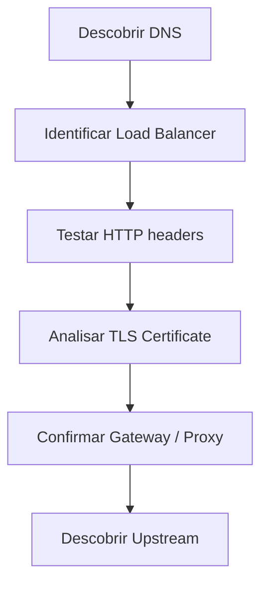

Método prático para descobrir a arquitetura de um gateway/API usando
apenas ferramentas padrão de linha de comando.

Ferramentas usadas:

-   dig / nslookup
-   curl
-   openssl
-   traceroute (opcional)

Esse método permite identificar:

-   DNS routing
-   load balancers
-   reverse proxies
-   gateways compartilhados
-   service mesh

------------------------------------------------------------------------

# Fluxo de investigação



------------------------------------------------------------------------

# 1 DNS Recon

Primeiro passo: descobrir para onde o domínio aponta.

``` bash
dig host.com
nslookup host.com
```

### O que procurar

  Sinal               Significado
  ------------------- -----------------------------
  CNAME               existe camada intermediária
  elb.amazonaws.com   AWS Load Balancer
  cloudfront.net      CDN
  cloudflare          proxy edge

Exemplo:

    api.example.com
      CNAME gateway.gtm.company.com
      CNAME internal-lb.elb.amazonaws.com

Isso indica:

    DNS → GTM → Load Balancer

------------------------------------------------------------------------

# 2 Descobrir o proxy HTTP

``` bash
curl -v https://host
```

Headers importantes:

  Header                          Indica
  ------------------------------- ------------------------
  server: envoy                   Envoy proxy
  server: nginx                   Nginx gateway
  via                             proxies intermediários
  x-forwarded-for                 proxy forwarding
  x-envoy-upstream-service-time   upstream interno

Exemplo:

    server: envoy
    x-envoy-upstream-service-time: 35

Conclusão:

Existe um **reverse proxy Envoy**.

------------------------------------------------------------------------

# 3 Descobrir se existe redirect

Redirect verdadeiro aparece assim:

    HTTP/1.1 301
    Location: https://novo-host

Se não existir `Location`, então:

    não existe redirect
    existe roteamento interno

------------------------------------------------------------------------

# 4 Inspecionar TLS

``` bash
openssl s_client -connect host:443 -servername host
```

Informações importantes:

-   CN
-   SAN
-   cadeia de certificados

Exemplo:

    CN = api-gateway-universal.company.com

Isso indica:

    host solicitado
        ↓
    gateway universal compartilhado

------------------------------------------------------------------------

# 5 Descobrir se é gateway compartilhado

Testar hosts diferentes:

    curl -v https://api1.company.com
    curl -v https://api2.company.com

Se ambos retornarem:

    server: envoy
    mesmo certificado

Então existe:

    gateway compartilhado

------------------------------------------------------------------------

# 6 Descobrir roteamento por path

``` bash
curl -v https://host/service1
curl -v https://host/service2
```

Comparar:

    x-envoy-upstream-service-time
    ``

    Mudança de latência indica **serviços diferentes**.

    ---

    # Arquitetura típica encontrada

    ```mermaid
    flowchart TD

    Client --> DNS
    DNS --> GTM
    GTM --> LoadBalancer
    LoadBalancer --> Gateway
    Gateway --> ServiceA
    Gateway --> ServiceB
    Gateway --> ServiceC

------------------------------------------------------------------------

# Comandos essenciais

## DNS

``` bash
dig host
nslookup host
```

## HTTP

``` bash
curl -v https://host
curl -vkI https://host
```

## TLS

``` bash
openssl s_client -connect host:443 -servername host
```

## Rede

``` bash
traceroute host
```

------------------------------------------------------------------------

# Heurísticas de diagnóstico

  Evidência              Conclusão
  ---------------------- ----------------------------
  CNAME → ELB            load balancer
  server: envoy          reverse proxy
  Location header        redirect
  CN diferente do host   gateway compartilhado
  x-forwarded headers    tráfego passando por proxy

------------------------------------------------------------------------

# Conclusão

Com apenas três ferramentas:

    dig
    curl
    openssl

é possível descobrir:

-   topologia de gateway
-   presença de proxies
-   arquitetura de balanceamento
-   possíveis upstreams

Esse método funciona para:

-   AWS API Gateway
-   Envoy
-   Kong
-   Apigee
-   Nginx Gateway
-   Cloudflare