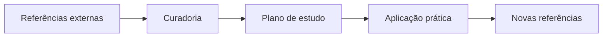

# 📚 Índice — Referências

A pasta **Referências** reúne materiais de apoio para continuidade dos estudos.



```text
Fonte externa -> Curadoria -> Prática -> Revisão contínua
```


## Objetivo

- Centralizar fontes externas úteis.
- Indicar trilhas de leitura e aprofundamento.
- Complementar os conteúdos autorais do repositório.

## O que você encontra aqui

- Literatura recomendada
- Recursos para evolução contínua

## Quando usar esta seção

Use esta pasta quando quiser expandir repertório, validar conceitos em outras fontes ou planejar os próximos estudos.