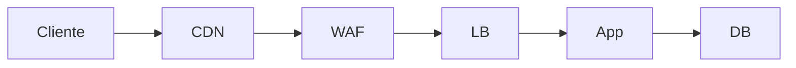
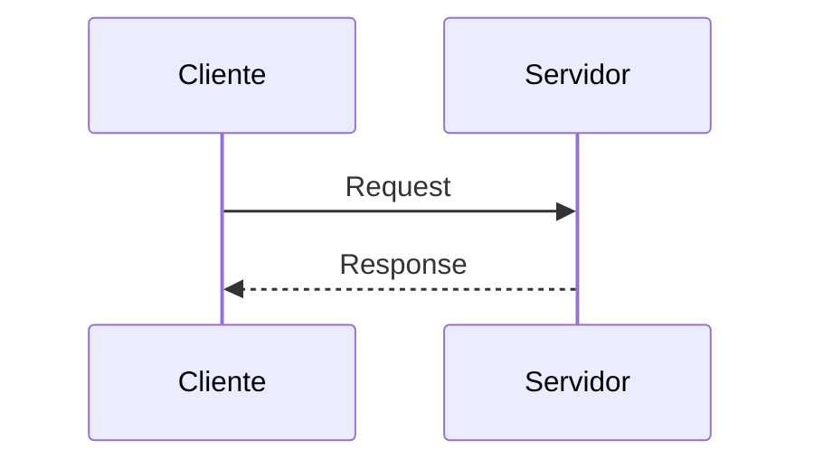

# Auditoria visual das notas (foco em diagramas e desenhos)

> Levantamento automático das notas para identificar onde **desenhos ASCII, diagramas ou imagens** podem acelerar entendimento.

- Total de notas analisadas: **179**.
- Notas com prioridade visual (filtro): **69**.

## Critérios usados

- Nota longa e predominantemente textual (sem imagem/mermaid).
- Presença de temas que costumam ficar mais claros com representação visual (fluxos, arquitetura, protocolos, comparações).
- Filtro mínimo de conteúdo: pelo menos 120 palavras.

## Prioridade alta por área

### Banco de dados
- `docs/Banco de dados/SQL/01 - Database & tables statements.md` (292 palavras): sugerido **fluxograma de processo + tabela comparativa**.
- `docs/Banco de dados/SQL/01 - SGBD.md` (227 palavras): sugerido **fluxograma de processo + tabela comparativa**.
- `docs/Banco de dados/Tipos de bancos/Banco relacional (SQL).md` (188 palavras): sugerido **diagrama de arquitetura + tabela comparativa**.
- `docs/Banco de dados/00 - Overview.md` (178 palavras): sugerido **diagrama de arquitetura + diagrama de sequência**.

### Ciber segurança
- `docs/Ciber segurança/Blue Team/SOC – Security Operations Center.md` (317 palavras): sugerido **fluxograma de processo + diagrama de arquitetura**.
- `docs/Ciber segurança/Red Team/Attacks/Wifi Attack.md` (441 palavras): sugerido **fluxograma de processo + tabela comparativa**.
- `docs/Ciber segurança/Red Team/Attacks/Spoof.md` (247 palavras): sugerido **fluxograma de processo + diagrama de sequência**.
- `docs/Ciber segurança/Criptografia/00 - Overview.md` (196 palavras): sugerido **fluxograma de processo + diagrama de sequência**.
- `docs/Ciber segurança/Blue Team/Blue Team.md` (193 palavras): sugerido **fluxograma de processo + diagrama de sequência**.
- `docs/Ciber segurança/OSINT/OSINT.md` (226 palavras): sugerido **fluxograma de processo**.

### Infraestrutura e DevOps
- `docs/Infraestrutura e DevOps/Kubernetes/00 - Visão Geral.md` (847 palavras): sugerido **fluxograma de processo + diagrama de arquitetura**.
- `docs/Infraestrutura e DevOps/Cloud/OpenStack/00 - OpenStack.md` (692 palavras): sugerido **fluxograma de processo + diagrama de arquitetura**.
- `docs/Infraestrutura e DevOps/DevOps Roadmap/00 - Gap Analysis DevOps Roadmap.md` (330 palavras): sugerido **fluxograma de processo + diagrama de arquitetura**.
- `docs/Infraestrutura e DevOps/Cloud/Proxmox/00 - Proxmox VE.md` (714 palavras): sugerido **fluxograma de processo + diagrama de arquitetura**.
- `docs/Infraestrutura e DevOps/Docker/05 - Compose/Sidecar.md` (385 palavras): sugerido **fluxograma de processo + diagrama de arquitetura**.
- `docs/Infraestrutura e DevOps/Docker/00 - Fundamentos/Dockerfile.md` (379 palavras): sugerido **fluxograma de processo + diagrama de arquitetura**.
- `docs/Infraestrutura e DevOps/Docker/04 - Networking/Networking.md` (299 palavras): sugerido **diagrama de arquitetura + diagrama de sequência**.
- `docs/Infraestrutura e DevOps/Cloud/AWS - Developer Certification/00 - Plano de Estudos.md` (234 palavras): sugerido **fluxograma de processo + diagrama de sequência**.

### Observability
- `docs/Observability/Loki/Loki.md` (413 palavras): sugerido **fluxograma de processo + diagrama de arquitetura**.
- `docs/Observability/Grafana/Grafana.md` (385 palavras): sugerido **fluxograma de processo + diagrama de arquitetura**.
- `docs/Observability/OpenTelemetry/Labs/observability-lab-complete-guide.md` (539 palavras): sugerido **fluxograma de processo + diagrama de arquitetura**.
- `docs/Observability/Jaeger/Jaeger.md` (431 palavras): sugerido **fluxograma de processo + diagrama de arquitetura**.
- `docs/Observability/Prometheus/Tipos de dados.md` (910 palavras): sugerido **fluxograma de processo + diagrama de sequência**.
- `docs/Observability/OpenTelemetry/Labs/Lab com Spring Boot.md` (372 palavras): sugerido **fluxograma de processo + diagrama de arquitetura**.
- `docs/Observability/00 - Trilha de estudos.md` (230 palavras): sugerido **fluxograma de processo + diagrama de arquitetura**.

### Planejamento de estudos
- `docs/Planejamento de estudos/Tópicos para estudar.md` (236 palavras): sugerido **fluxograma de processo + diagrama de arquitetura**.

### Programação
- `docs/Programação/Conceitos para estudar.md` (148 palavras): sugerido **diagrama de arquitetura + mapa mental**.

### Redes
- `docs/Redes/04 - Serviços de Rede/Proxy.md` (339 palavras): sugerido **fluxograma de processo + diagrama de arquitetura**.
- `docs/Redes/03 - Protocolos/TCP/TCP.md` (470 palavras): sugerido **fluxograma de processo + diagrama de sequência**.
- `docs/Redes/Oque acontece em uma requisição a um site?.md` (342 palavras): sugerido **fluxograma de processo + diagrama de sequência**.
- `docs/Redes/03 - Protocolos/IP Público vs IP Privado.md` (314 palavras): sugerido **fluxograma de processo + diagrama de sequência**.
- `docs/Redes/06 - Laboratórios/Laboratorios.md` (306 palavras): sugerido **fluxograma de processo + diagrama de sequência**.
- `docs/Redes/01 - Modelo OSI/Camadas/Camada 4 Transporte.md` (298 palavras): sugerido **fluxograma de processo + diagrama de sequência**.
- `docs/Redes/05 - Segurança/SSH.md` (279 palavras): sugerido **diagrama de arquitetura + diagrama de sequência**.
- `docs/Redes/05 - Segurança/Firewall.md` (273 palavras): sugerido **fluxograma de processo + diagrama de sequência**.

### Referências
- `docs/Referências/Literatura para evoluir como DEV.md` (1448 palavras): sugerido **fluxograma de processo + diagrama de arquitetura**.

### Sistemas operacionais
- `docs/Sistemas operacionais/Linux/Fundamentos/01 - Sistema de arquivos/Estrutura de Diretórios do Linux (FHS).md` (533 palavras): sugerido **fluxograma de processo + diagrama de arquitetura**.
- `docs/Sistemas operacionais/Linux/Fundamentos/09 - Comandos/systemctl.md` (485 palavras): sugerido **fluxograma de processo + diagrama de arquitetura**.
- `docs/Sistemas operacionais/Linux/Fundamentos/08 - Logs e troubleshooting/Logs e Troubleshooting.md` (307 palavras): sugerido **fluxograma de processo + diagrama de arquitetura**.
- `docs/Sistemas operacionais/Linux/Fundamentos/06 - Networling/Networking Básico.md` (230 palavras): sugerido **fluxograma de processo + diagrama de arquitetura**.
- `docs/Sistemas operacionais/Windows/CLI/cmd.md` (469 palavras): sugerido **fluxograma de processo + diagrama de sequência**.
- `docs/Sistemas operacionais/Windows/Active Directory/01 - Active Directory.md` (385 palavras): sugerido **diagrama de arquitetura + diagrama de sequência**.
- `docs/Sistemas operacionais/Sistemas operacionais.md` (208 palavras): sugerido **fluxograma de processo + diagrama de arquitetura**.
- `docs/Sistemas operacionais/Linux/Fundamentos/04 - systemd e serviços/systemd e Serviços.md` (315 palavras): sugerido **fluxograma de processo + tabela comparativa**.

### index.md
- `docs/index.md` (195 palavras): sugerido **diagrama de arquitetura + mapa mental**.

## Padrões de visual recomendados

1. **Fluxograma em ASCII** para processos e troubleshooting rápido.
2. **Mermaid flowchart** para arquitetura e relações entre componentes.
3. **Mermaid sequenceDiagram** para protocolos de rede e segurança.
4. **Tabela comparativa** para conteúdos “A vs B” (ex.: TCP vs UDP, SQL vs NoSQL).
5. **Mapa mental** para overviews e roadmaps de estudo.

## Modelo pronto (copiar e colar nas notas)

```text
[Cliente] -> [DNS] -> [App] -> [DB]
                 |
               [Cache]
```





## Próximos passos sugeridos

- Começar pelas notas de maior prioridade de cada área e inserir **1 visual por nota**.
- Preferir ASCII para revisão rápida no terminal e Mermaid para material de referência no MkDocs.
- Marcar no final da nota: `Visual adicionado em: AAAA-MM-DD` para acompanhar evolução.