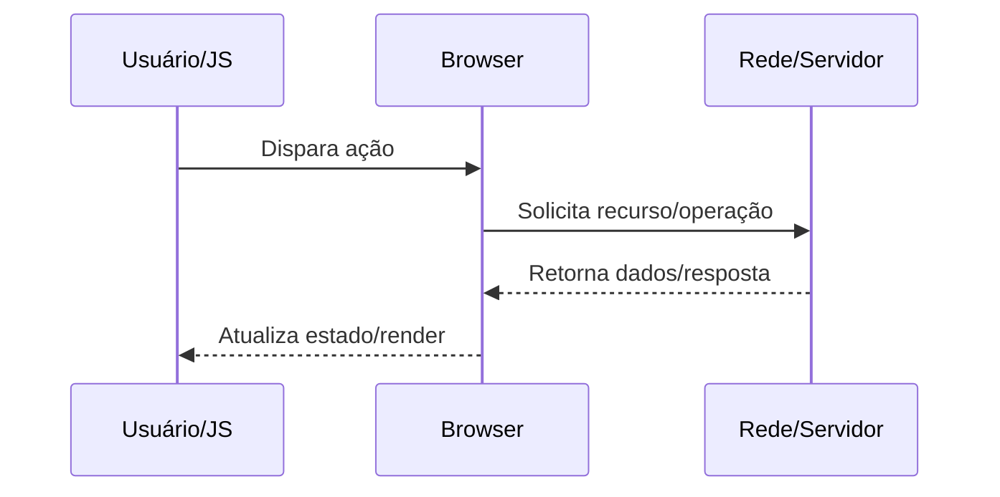

docs/Web/Browser/Browser Storage/LocalStorage.md

# LocalStorage

## O que é

LocalStorage descreve uma parte específica do pipeline web entre rede, runtime e renderização.

## Por que isso existe

Para padronizar comportamento entre navegadores e tornar apps web previsíveis em escala.

## Como funciona internamente

1. Entrada do usuário ou script dispara uma operação.
2. Browser agenda trabalho entre processos/threads internos.
3. Camadas de rede, segurança e renderização são acionadas conforme dependências.
4. Estado final é refletido no DOM/UI e em métricas de performance.

## Fluxo de funcionamento



## Exemplo prático

```bash
curl -I https://example.com
```

```http
GET /resource HTTP/1.1
Host: example.com
Accept: */*
```

## Quando isso é importante para um engenheiro backend/devops

- Diagnóstico de incidentes de latência, erros intermitentes e saturação de recursos.
- Definição de estratégia de cache, balanceamento, TLS termination e observabilidade.
- Revisão de segurança em headers, cookies, políticas de origem e proteção de sessão.
- Planejamento de capacidade (conexões concorrentes, CPU por handshake, egress).

## Problemas comuns

- Assumir que problema está apenas no backend sem validar DNS/TCP/TLS/browser.
- Ignorar diferença entre ambiente local, staging e produção (proxy/CDN/WAF).
- Não correlacionar waterfall do navegador com tracing e logs do servidor.
- Configurar timeouts/retries de forma incompatível entre camadas.

## Relação com outros conceitos

Relaciona-se com:
- [[HTTP]]
- [[DNS]]
- [[TLS]]
- [[TCP]]
- [[Critical Rendering Path]]
- [[Event Loop]]
