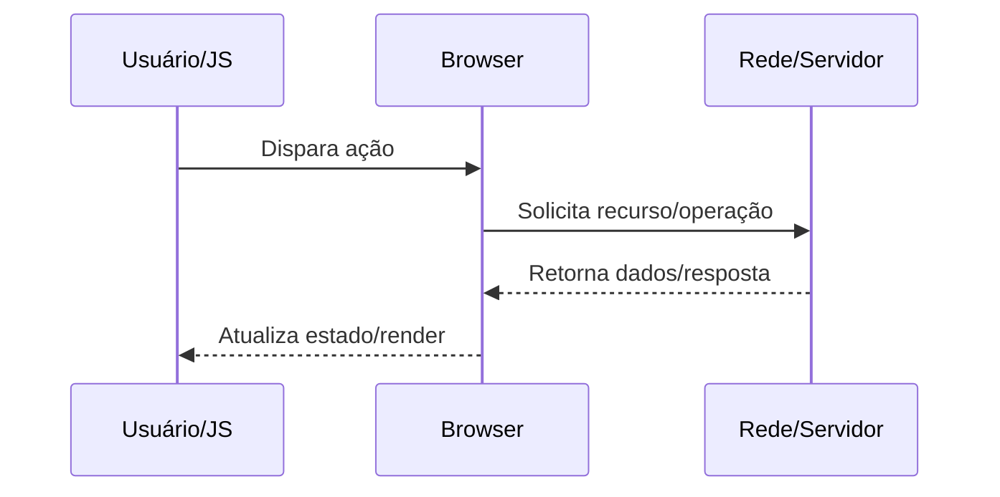

docs/Web/Browser/Networking/Como o navegador abre uma conexão TCP.md

# Como o navegador abre uma conexão TCP

## O que é

Estabelece canal confiável orientado a conexão via three-way handshake.

## Por que isso existe

Garantir entrega ordenada, controle de congestionamento e retransmissão em links instáveis.

## Como funciona internamente

1. Escolhe IP/porta de destino e porta efêmera local.
2. Envia SYN com número inicial de sequência.
3. Recebe SYN-ACK e responde ACK, estabelecendo estado ESTABLISHED.
4. Aplica slow start, janela de congestionamento e RTT estimado.

## Fluxo de funcionamento



## Exemplo prático

```bash
sudo tcpdump -ni any tcp port 443
ss -ti
```

```http
GET /resource HTTP/1.1
Host: example.com
Accept: */*
```

## Quando isso é importante para um engenheiro backend/devops

- Diagnóstico de incidentes de latência, erros intermitentes e saturação de recursos.
- Definição de estratégia de cache, balanceamento, TLS termination e observabilidade.
- Revisão de segurança em headers, cookies, políticas de origem e proteção de sessão.
- Planejamento de capacidade (conexões concorrentes, CPU por handshake, egress).

## Problemas comuns

- Assumir que problema está apenas no backend sem validar DNS/TCP/TLS/browser.
- Ignorar diferença entre ambiente local, staging e produção (proxy/CDN/WAF).
- Não correlacionar waterfall do navegador com tracing e logs do servidor.
- Configurar timeouts/retries de forma incompatível entre camadas.

## Relação com outros conceitos

Relaciona-se com:
- [[HTTP]]
- [[DNS]]
- [[TLS]]
- [[TCP]]
- [[Critical Rendering Path]]
- [[Event Loop]]
