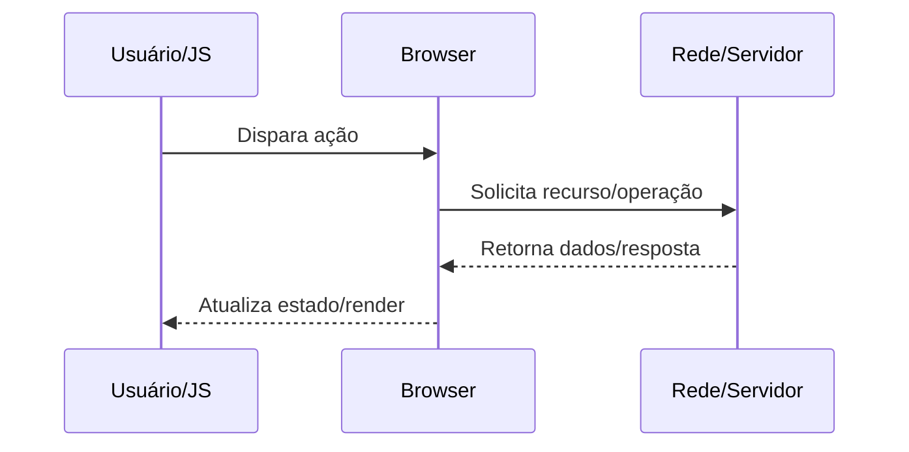

docs/Web/Browser/Networking/Como o navegador resolve DNS.md

# Como o navegador resolve DNS

## O que é

Mapeia hostname para IP usando cache local, resolver do SO, DNS recursivo e, em alguns cenários, DoH/DoT.

## Por que isso existe

Evitar hardcode de IP e permitir balanceamento geográfico, failover e rotação transparente de infraestrutura.

## Como funciona internamente

1. Verifica cache DNS do browser e cache do sistema operacional.
2. Se não houver entrada válida, envia consulta ao resolvedor configurado (UDP/TCP 53 ou HTTPS no DoH).
3. Resolvedor faz iteração/recursão: root -> TLD -> authoritative.
4. Resposta retorna com TTL; browser guarda em cache e inicia conexão para o IP escolhido.

## Fluxo de funcionamento



## Exemplo prático

```bash
dig +trace example.com
nslookup example.com
```

```http
GET /resource HTTP/1.1
Host: example.com
Accept: */*
```

## Quando isso é importante para um engenheiro backend/devops

- Diagnóstico de incidentes de latência, erros intermitentes e saturação de recursos.
- Definição de estratégia de cache, balanceamento, TLS termination e observabilidade.
- Revisão de segurança em headers, cookies, políticas de origem e proteção de sessão.
- Planejamento de capacidade (conexões concorrentes, CPU por handshake, egress).

## Problemas comuns

- Assumir que problema está apenas no backend sem validar DNS/TCP/TLS/browser.
- Ignorar diferença entre ambiente local, staging e produção (proxy/CDN/WAF).
- Não correlacionar waterfall do navegador com tracing e logs do servidor.
- Configurar timeouts/retries de forma incompatível entre camadas.

## Relação com outros conceitos

Relaciona-se com:
- [[HTTP]]
- [[DNS]]
- [[TLS]]
- [[TCP]]
- [[Critical Rendering Path]]
- [[Event Loop]]
