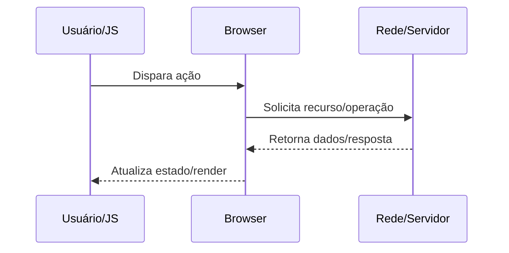

docs/Web/Browser/Networking/Connection pooling.md

# Connection pooling

## O que é

Reuso de conexões já estabelecidas para reduzir handshake e latência.

## Por que isso existe

Evitar custo de abrir conexão a cada request e limitar pressão em sockets/TLS.

## Como funciona internamente

1. Browser mantém pool por origem/ALPN/política de segurança.
2. Nova request tenta pegar conexão idle compatível.
3. Se não houver, abre nova até limite por host.
4. Conexões ociosas expiram por idle timeout.

## Fluxo de funcionamento



## Exemplo prático

```bash
# observar conexões reutilizadas
curl -v https://example.com https://example.com/about
```

```http
GET /resource HTTP/1.1
Host: example.com
Accept: */*
```

## Quando isso é importante para um engenheiro backend/devops

- Diagnóstico de incidentes de latência, erros intermitentes e saturação de recursos.
- Definição de estratégia de cache, balanceamento, TLS termination e observabilidade.
- Revisão de segurança em headers, cookies, políticas de origem e proteção de sessão.
- Planejamento de capacidade (conexões concorrentes, CPU por handshake, egress).

## Problemas comuns

- Assumir que problema está apenas no backend sem validar DNS/TCP/TLS/browser.
- Ignorar diferença entre ambiente local, staging e produção (proxy/CDN/WAF).
- Não correlacionar waterfall do navegador com tracing e logs do servidor.
- Configurar timeouts/retries de forma incompatível entre camadas.

## Relação com outros conceitos

Relaciona-se com:
- [[HTTP]]
- [[DNS]]
- [[TLS]]
- [[TCP]]
- [[Critical Rendering Path]]
- [[Event Loop]]
