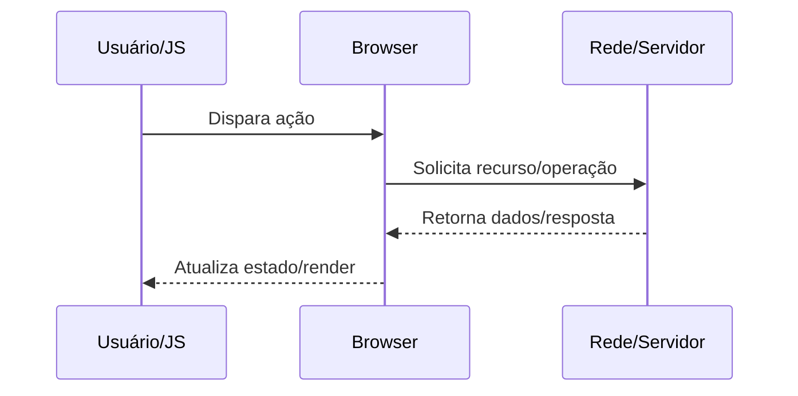

docs/Web/Browser/Networking/HTTP request lifecycle no navegador.md

# HTTP request lifecycle no navegador

## O que é

Ciclo completo da requisição: criação, envio, processamento, resposta e integração com renderização.

## Por que isso existe

Padronizar interoperabilidade entre browser e servidores, com semântica de métodos e headers.

## Como funciona internamente

1. Service Worker pode interceptar antes da rede.
2. Se necessário, resolve DNS, abre conexão e negocia TLS/ALPN.
3. Envia request com cookies, headers condicionais e prioridade.
4. Recebe resposta, avalia cache/políticas e entrega ao parser/JS.

## Fluxo de funcionamento



## Exemplo prático

```bash
curl -v https://example.com -H "Accept: text/html"
```

```http
GET /resource HTTP/1.1
Host: example.com
Accept: */*
```

## Quando isso é importante para um engenheiro backend/devops

- Diagnóstico de incidentes de latência, erros intermitentes e saturação de recursos.
- Definição de estratégia de cache, balanceamento, TLS termination e observabilidade.
- Revisão de segurança em headers, cookies, políticas de origem e proteção de sessão.
- Planejamento de capacidade (conexões concorrentes, CPU por handshake, egress).

## Problemas comuns

- Assumir que problema está apenas no backend sem validar DNS/TCP/TLS/browser.
- Ignorar diferença entre ambiente local, staging e produção (proxy/CDN/WAF).
- Não correlacionar waterfall do navegador com tracing e logs do servidor.
- Configurar timeouts/retries de forma incompatível entre camadas.

## Relação com outros conceitos

Relaciona-se com:
- [[HTTP]]
- [[DNS]]
- [[TLS]]
- [[TCP]]
- [[Critical Rendering Path]]
- [[Event Loop]]
