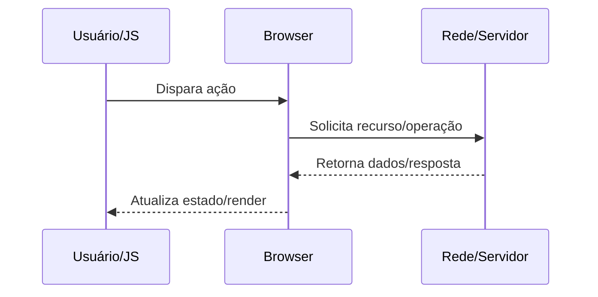

docs/Web/Browser/Networking/HTTP-1 vs HTTP-2 vs HTTP-3 no browser.md

# HTTP/1 vs HTTP/2 vs HTTP/3 no browser

## O que é

Versões do protocolo com diferentes estratégias de multiplexação e transporte.

## Por que isso existe

Reduzir head-of-line blocking e melhorar eficiência em páginas com muitos recursos.

## Como funciona internamente

1. HTTP/1.1 usa múltiplas conexões e pipelining pouco confiável.
2. HTTP/2 multiplexa streams sobre um TCP único com HPACK.
3. HTTP/3 roda sobre QUIC/UDP com criptografia obrigatória e QPACK.
4. ALPN durante TLS/QUIC define versão final.

## Fluxo de funcionamento



## Exemplo prático

```bash
curl --http1.1 -I https://example.com
curl --http2 -I https://example.com
curl --http3 -I https://example.com
```

```http
GET /resource HTTP/1.1
Host: example.com
Accept: */*
```

## Quando isso é importante para um engenheiro backend/devops

- Diagnóstico de incidentes de latência, erros intermitentes e saturação de recursos.
- Definição de estratégia de cache, balanceamento, TLS termination e observabilidade.
- Revisão de segurança em headers, cookies, políticas de origem e proteção de sessão.
- Planejamento de capacidade (conexões concorrentes, CPU por handshake, egress).

## Problemas comuns

- Assumir que problema está apenas no backend sem validar DNS/TCP/TLS/browser.
- Ignorar diferença entre ambiente local, staging e produção (proxy/CDN/WAF).
- Não correlacionar waterfall do navegador com tracing e logs do servidor.
- Configurar timeouts/retries de forma incompatível entre camadas.

## Relação com outros conceitos

Relaciona-se com:
- [[HTTP]]
- [[DNS]]
- [[TLS]]
- [[TCP]]
- [[Critical Rendering Path]]
- [[Event Loop]]
