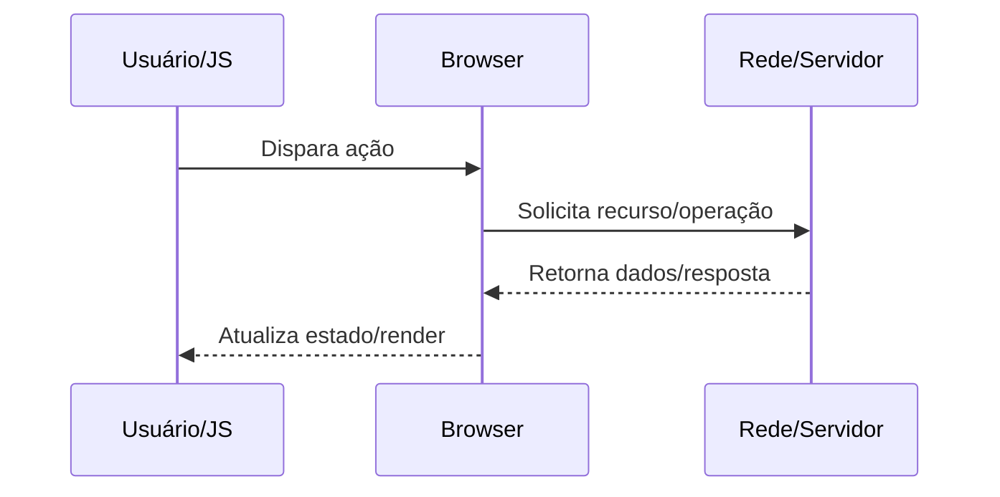

docs/Web/Browser/Networking/Keep Alive.md

# Keep Alive

## O que é

Mecanismo para manter conexões persistentes entre múltiplas requisições.

## Por que isso existe

Diminuir RTT acumulado e overhead de CPU em TLS/TCP handshake.

## Como funciona internamente

1. Servidor anuncia persistência (HTTP/1.1 padrão) e limites opcionais.
2. Cliente reutiliza socket até timeout/max requests.
3. Middlewares/proxies podem encerrar por políticas próprias.
4. Aplicação precisa ajustar timeouts para não gerar reset prematuro.

## Fluxo de funcionamento



## Exemplo prático

```bash
curl -I https://example.com -H "Connection: keep-alive"
```

```http
GET /resource HTTP/1.1
Host: example.com
Accept: */*
```

## Quando isso é importante para um engenheiro backend/devops

- Diagnóstico de incidentes de latência, erros intermitentes e saturação de recursos.
- Definição de estratégia de cache, balanceamento, TLS termination e observabilidade.
- Revisão de segurança em headers, cookies, políticas de origem e proteção de sessão.
- Planejamento de capacidade (conexões concorrentes, CPU por handshake, egress).

## Problemas comuns

- Assumir que problema está apenas no backend sem validar DNS/TCP/TLS/browser.
- Ignorar diferença entre ambiente local, staging e produção (proxy/CDN/WAF).
- Não correlacionar waterfall do navegador com tracing e logs do servidor.
- Configurar timeouts/retries de forma incompatível entre camadas.

## Relação com outros conceitos

Relaciona-se com:
- [[HTTP]]
- [[DNS]]
- [[TLS]]
- [[TCP]]
- [[Critical Rendering Path]]
- [[Event Loop]]
