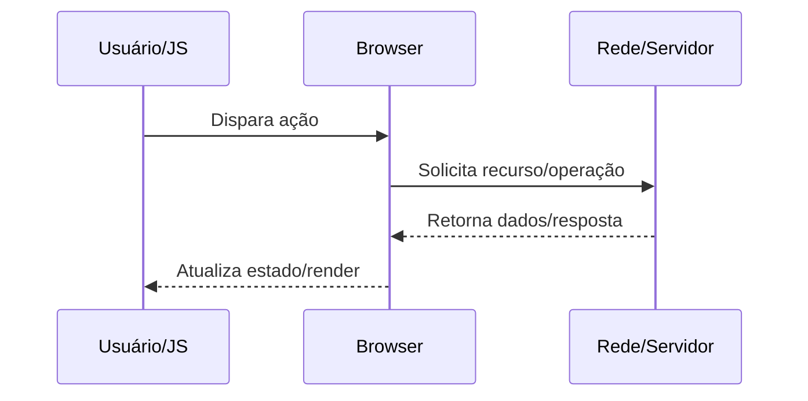

docs/Web/Browser/Networking/TLS handshake no navegador.md

# TLS handshake no navegador

## O que é

Negociação criptográfica sobre TCP (ou QUIC) para autenticar servidor e derivar chaves de sessão.

## Por que isso existe

Proteger confidencialidade/integridade e impedir MITM em tráfego HTTP.

## Como funciona internamente

1. ClientHello envia versões, cipher suites, SNI e ALPN.
2. ServerHello escolhe parâmetros, envia certificado e prova de chave.
3. Cliente valida cadeia CA, hostname e validade temporal.
4. Ambos derivam chaves (ECDHE), trocam Finished e iniciam tráfego cifrado.

## Fluxo de funcionamento



## Exemplo prático

```bash
openssl s_client -connect example.com:443 -servername example.com -alpn h2
```

```http
GET /resource HTTP/1.1
Host: example.com
Accept: */*
```

## Quando isso é importante para um engenheiro backend/devops

- Diagnóstico de incidentes de latência, erros intermitentes e saturação de recursos.
- Definição de estratégia de cache, balanceamento, TLS termination e observabilidade.
- Revisão de segurança em headers, cookies, políticas de origem e proteção de sessão.
- Planejamento de capacidade (conexões concorrentes, CPU por handshake, egress).

## Problemas comuns

- Assumir que problema está apenas no backend sem validar DNS/TCP/TLS/browser.
- Ignorar diferença entre ambiente local, staging e produção (proxy/CDN/WAF).
- Não correlacionar waterfall do navegador com tracing e logs do servidor.
- Configurar timeouts/retries de forma incompatível entre camadas.

## Relação com outros conceitos

Relaciona-se com:
- [[HTTP]]
- [[DNS]]
- [[TLS]]
- [[TCP]]
- [[Critical Rendering Path]]
- [[Event Loop]]
